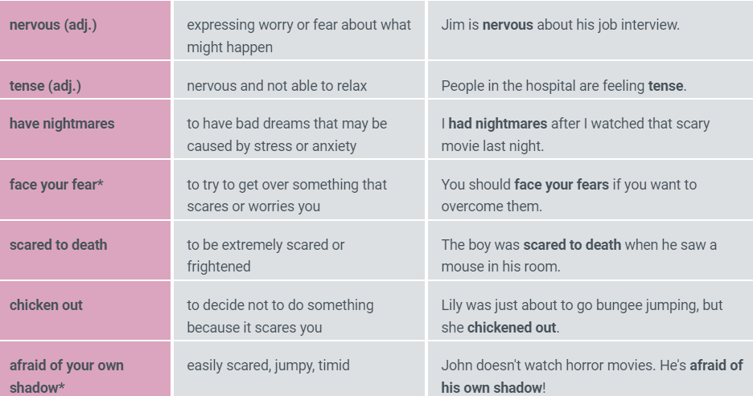

A **competitive salary** means that a company pays as well or better than other similar companies

**Work- life balance** is the amount of time you spend at work compared to the amount of time you spend with your family or pursuing personal interests.

**A fast paced work environment** is one in which employees are expected to work quickly and efficiently, often with tight deadlines and high pressure. This type of environment is common in industries such as finance, technology, and media.

A **high- pressure job** is one which is very demanding and involves high levels of stress.

To **work well under pressure** means that you are able to work quickly and efficiently despite having many things to do and deadlines to meet.

To be **out of work** is to be unemployed.
'I'm out of work at the moment. I need to find a new job soon.'

**apply for a job**

**a job offer**

**Monotonous** - **dull and repetitive or lacking in variety**

Here are some notes for the English idioms and phrases you provided:

1. **To be a high flyer**:

   - This idiom refers to **someone who is very successful, powerful, and wealthy in their job or career**.
   - Example: "Although high-flyers appear to lead glamorous lives, many suffer from chronic stress."
   - **To have a high-flying job**: This phrase means to **have a job or position that is considered prestigious, important, or high-level**. Example: "He has a high-flying job in the banking sector."

2. **To get down to business**:

   - This idiom means to **get serious about what needs to be done or to start negotiating or discussing business matters**.
   - Example: "Let's get down to business everyone, we have a deadline to meet."
   - "Let's cut the small talk and get down to business. Are you interested in what I'm offering you?"

3. **To have your work cut out**:

   - This idiom means that you have **something very difficult or challenging to do, or that you will need to work hard to achieve a particular goal**.
   - Example: "You will have your work cut out for you in the sales department, it's always extremely busy."

4. **To be at the cutting edge**:

   - This phrase means that something is at the **latest stage of development or at the forefront of progress in its area or field**.
   - Example: "The technology firm is at the cutting edge of developments in computer software."

5. **To go the extra mile**:

   - This idiom means to **do more than is expected of you, to try harder, or make a greater effort to achieve a goal or help someone**.
   - Example: "Alex goes the extra mile to make sure his designs are exceptional."

6. **To put in the hours**:

   - This phrase means to **invest the time necessary in order to accomplish something, such as a project, skill, or goal**.
   - Example: "You won't graduate from law school unless you are prepared to put in the hours."

7. **To work around the clock**:

   - This idiom means to **work very long hours, often without stopping or taking breaks, in order to meet a deadline or achieve a goal**.
   - Example: "I have to work around the clock to afford this apartment."

8. **To have a lot on your plate**:

   - This idiom means to **have a lot of things to do or deal with, often to the point of feeling overwhelmed or stressed**.
   - Example: "I work full time and I recently had a baby so I have a lot on my plate right now."

9. **To be up to your eyes in something**:

   - This idiom means that you are **extremely busy or heavily involved in something, to the point where you have no time for anything else**.
   - Example: "There's no way I can take a day off, I'm up to my eyes in training the new staff."
   - Note: This idiom is sometimes abbreviated to just "up to my eyes." Example: "I can't do it right now, I'm up to my eyes at the moment."

10. **To be stressed out**: **feeling tired, anxious, and sad due to excessive work or pressure**.
11. **To have a heavy workload**: **having a lot of work to accomplish**.
12. **To feel overwhelmed**: **feeling unable to cope with too much to do**.
13. **To take downtime**: **to take a break and relax, not do much**.
14. **To take a career break**: **to intentionally stop working for a significant period, often to travel or have children**.
15. **To unwind**: **to calm and relax the mind and body after stress or tension**.
16. **To recharge your batteries**: **to rest and recover energy after being very busy**.

17. **While**: used to **indicate two things happening at the same time or to show contrast/concession**.
18. **While/Whilst/Whereas**: used to **show contrast between two things, similar to "although." While and whereas clauses can come before or after the main clause. Whilst is less common and more formal**.

19. **But** contrasts two points in the same sentence. E.g., "I'd like to go to the party but I don't have anything to wear."

20. **However** starts a sentence, contrasting with the previous sentence. It's more formal than "but" and followed by a comma. E.g., "I had a good holiday. However, I was disappointed that there wasn't much snow."

21. **Nevertheless** is similar to "however" but more formal/literary. E.g., "I had a good holiday. Nevertheless, I was disappointed that there wasn't much snow."

# 28/5/2024

22. **To take on**:

    - **Hire**: "We are so busy at the moment, I'm going to have to take on more staff."
    - **Accept more work/responsibility**: "I can't take on any more work at the moment."

23. **To lay someone off**: **End employment due to lack of work**. "The company is losing money so it looks like they are going to start laying people off."

24. **To get ahead**: **Become successful in work**. "I decided that if I was going to get ahead in life, I would have to move to a bigger city."

25. **To fill in for somebody** means to do somebody's work for them when they cannot. "I am filling in for Jessica while she's on holiday."

26. **To pull out of something** means to end involvement in a deal, project, or arrangement. "The company's decision to pull out of the investment deal has caused great anger."

27. **To run something by someone** means to tell someone your ideas to hear their opinion. "If you have a few minutes to spare, I'd like to run my ideas for the conference by you."

28. **To burn out** means that you become exhausted or ill from working too hard. "You must be careful to take time to relax. You will burn out if you continue working so hard."

29. **To cash in on something** means to make a lot of money from an event or situation. It sometimes implies that the money is made unfairly. "The documentary makers were accused of trying to cash in on the singer's death."

30. If an event or deal **falls through**, it means it fails to happen. "In the end, the deal fell through when the investors changed their minds."

31. **To meet up with someone** means that you meet them in an agreed location to accomplish something. "We decided to meet up over coffee to discuss the deal further."

32. **To smarten up** has two different meanings depending on the region:

    - In the UK: **To improve your appearance**. "You'll need to smarten yourself up before your interview; you'd better get your hair done and buy some new clothes."
    - In the US: **To change the way you do things**. "You'd better smarten up and start studying more if you want to finish your degree."

33. **To stay behind** means to remain somewhere after other people have left. "I had to stay behind at work today to finish the reports."

34. **To ask around** means to ask a lot of people the same question. "I've asked around the office, but nobody knows when the training days will be."

35. **To step down** means to leave an important position voluntarily. "He decided to step down as C.E.O after a period of ill health."

36. **To work on** means to improve or develop something. "I am working on my thesis at the moment." "The researchers are working on a way to reduce the carbon emissions from the factories."

### They are hoping that the deal won't **\*\***\_\_\_**\*\*** at the last minute. _fall through_

### I think you need to **\*\***\_\_**\*\*** your appearance if you want to work in marketing.

### There aren't enough team members to do everything. We need to **\*\***\_\_\_**\*\***. _take on more staff_

## Summary

---

## B2 course

phobia - an extreme or irrational fear of something
aerophobia - fear of flying

faint - feeling weak and dizzy and close to losing consciousness.
panic - sudden uncontrollable fear or anxiety
tense - anxious or nervous
scared to death - extremely scared
afraid of your own shadow - extremely fearful

| Adjectives                 | Adverbs                            |
| -------------------------- | ---------------------------------- |
| The song sounds terrible.  | The band played the song terribly. |
| The food smells delicious. | He cooked the food deliciously.    |
| He looks angry.            | He looked at me angrily.           |

"The song sounds terrible." Here, "terrible" describes the quality of the song, so it's an adjective modifying the noun "song."

"The band played the song terribly." In this sentence, "terribly" describes how the action of playing was performed, so it's an adverb modifying the verb "played."

---

Adjectives with "-ed" express emotions, while adjectives with "-ing" cause emotions.

- Amaze: Concert was amazing! I was amazed.
- Frighten: Car accident is frightening. She was frightened.
- Terrify: Saw terrifying spider. I am terrified.
- Interest: Paris is interesting. They are interested.

---

My sister is **extremely angry** because the dry cleaner lost her wedding dress.
My sister is **furious** because the dry cleaner lost her wedding dress.

Max has never been to the circus. He's **extremely scared** of clowns.
Max has never been to the circus. He's completely **terrified** of clowns.

---

| Regular Adjective | Extreme Adjective         | Example                                                  |
| ----------------- | ------------------------- | -------------------------------------------------------- |
| hot               | boiling                   | Expect boiling temperatures for the next two weeks.      |
| hungry            | starving                  | I'm starving. I haven't eaten since yesterday.           |
| tired             | exhausted                 | You look exhausted. Did you get enough sleep?            |
| small             | tiny                      | All insects scare my brother, even tiny ones.            |
| big               | giant, huge, enormous     | Jack lives in a giant house with six bedrooms.           |
| bad               | terrible, horrible, awful | Sue said she had a horrible experience at the dentist.   |
| good              | wonderful, fantastic      | The food at the Korean restaurant downtown is fantastic. |
