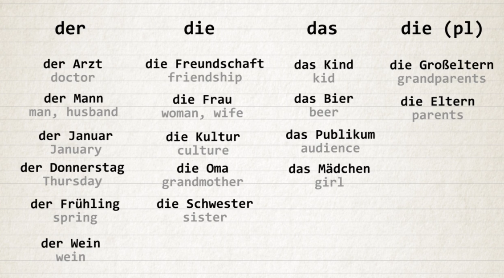

....

## 8/5/2024

**z** sounds like [ts]
**ei** sounds like [ay]
**w** what? => was?
double consonant is pronounced faster eg: ll
**r** as a rolled throaty gurgling [rrr]
or a short reduced [ah] sound when at the end of the word
In **v**, there are two sounds. One is original german words, F and next one is borrowed words, W.
IE pronounces [eee] => long slow e
**s** at the beginning of a word is pronounced as [z]
otherwise **s** is pronounced as [s]
**st** is pronounced as [sht]
**sp** is pronounced as [shp]
**ss** is used after a short vowel Eg. essen
**ß** is used after a long vowel Eg. Straße
**H** is silent in German when standing alone, except at the beginning of a word
**Ch** is pronounced as [hh]
**SCH** is pronounced as [sh]
**TSCH** is pronounced as [ch]

Vocabulary
null
eins
Zwei
drei
vier
fünf
sechs
sieben
acht
neun
zehn
elf
zwölf

---

[5/10/2024]
Mein Name ist... - My name is...
Wie ist dein Name? - What is your name?
Ich heiße... - My name is...
Wie heißt du? - What is your name?
Wie heißen sie? (formal)

der Name
der Vorname - first name
der Nachname - last name
heißen - to be called
dein - your

Sie -
older
higher position
showing respect

𝚗𝚠𝚒𝚗, [5/10/2024 9:38 AM]
Wie heißen Sie? - What is your name? (formal)
Wer bist du? - Who are you? (informal)
Wer sind Sie? - Who are you? (formal)
Wer ist das? - Who is that?
Ich weiß nicht. - I don't know.

der Mann - the man
die Frau - the woman

Woher kommst du? - Where are you from? (informal)
Ich komme aus - I am from...
aus den Vereinigten Staaten - from the United States
aus der Schweiz
aus der Türkei
aus den Niederlanden

gut - good
sehr gut - very good
prima - great
schlecht - bad
sehr schlecht
soso - average
Nicht schlecht, und dir?
gehts = es geht
Wie ghets? how it is going?
Wie geht es Ihnen? - How are you? (formal)
Wie geht es dir? - How are you? (informal)

Wer? - Who?
Wie? - How?
Woher? - Where from?
Wo? - Where?
Was? - What?
Wie bitte? - Excuse me

"Wie ist dein Name?' would literally be translated as 'How is your
name?'. But since that sounds very silly in English, we translate it as 'What
is your name?'."

---

ich
du
er, sie, es
wir
ihr
sie
Sie
duzen
siezen
Du kannst mich duzen.

Once a day, one part of it
https://youtu.be/zMO9Ew8n7MM?si=uko6zmJ9sSGqhOm1

---

https://www.heylama.com/blog/free-online-german-language-courses-from-a1-to-c1

### Present tense

kochen - to cook
en - infinitive ending

ich - e
du - st
er, sie, es - t
wir - en
ihr - t
sie, Sie - en

danke - thank you
bitte - you are welcome, here you go
danke schön - thank you very much
danke sehr - thanks a lot
tut mir leid - I am sorry
entschuldigung - excuse me

write down the words I learnt
danke
danke schön
danke sehr
bitte
bitte schon
bitte sehr
gern geschehen
tut mir leid
enstchuldingung
nichts zu danken

https://www.linguee.com/

die Mutter - mother
der Vater - father
die Eltern - parents
der Mann - husband
die Frau - wife
die kinder - kids
der sohn - son
die Tochter - daughter
der burder - brother
die Schwester - sister
die Großmutter, die Oma - grandmother
der Großvater,der Opa - grandfather
die Großeltern - grandparents
die Geschwister - siblings
die Tante - aunt
der Onkel - uncle
die Cousine - cousin (female)
der Cousin - cousin (male)

---

https://learngerman.dw.com/de/nicos-weg/c-36519687

https://docs.google.com/document/d/1J5PJK0qStw2DHQHdRHuKIfq_bJrZkFarQVT7fkz13tg/edit

der - masuline
die - feminine
das - neutral
die - plural

## der masculine

**for male people and professions**
der Vater
der Bruder
der Arzt - doctor

**weekdays, months and seasons**
der Montag
der Januar
der Sommer

**Words that end with -er**
der Computer
der Lehrer - teacher
der Koffer - suitcase

**Cars and alcoholic drinks**
der BMW
der Whiskey
der Wein - wine
Exception: das Bier - beer

## Die feminine

**for female people and professions**
die Mutter
die Schwester
die Ärztin - doctor

**Words ending in -heit and -keit**
die Freiheit - freedom
die Möglichkeit - possibility
die Schwierigkeit - difficulty

**words ending in -schaft**
die Freundschaft - friendship
die Mannschaft - team

**Words ending in -ung**
die Übung - exercise

**words ending with -ur**
die Natur - nature

**words ending with -e**
die Lampe - lamp
die Tasche - bag

### das neutral

**all the words that end in -chen**
das Mädchen - girl

**all the words that end in -lein**
das Fräulein - miss

**Most Latin based words**
das Zentrum - center
das Hotel - hotel

## Mein vs Meine

verb "sein" (to be):
• ich bin
• du bist
• er, sie, es ist
• wir sind
• ihr seid
• sie sind
• Sie sind

die sprache - language schpraa·cha
sprechen - to speak, talk

Welche Sprachen sprichst du? - What languages do you speak?

---
