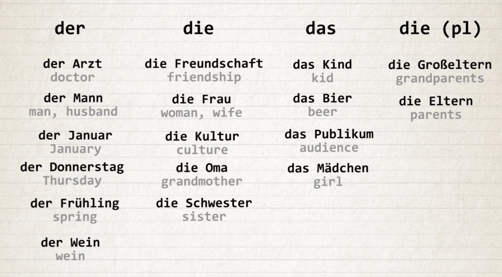
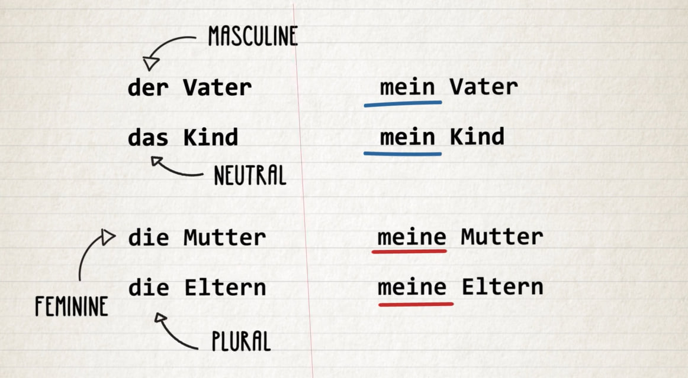
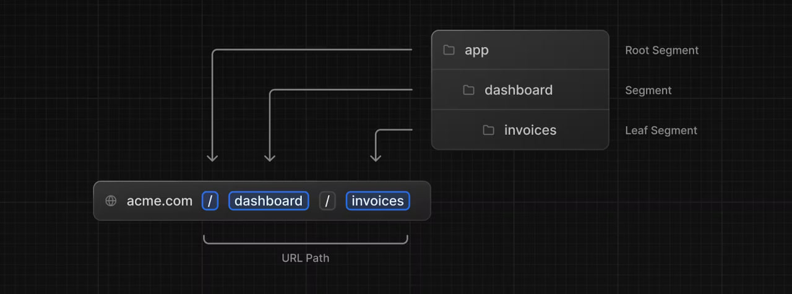

# Time Table from 17 - 31

---

Day 1 - 17/4/2024 - 13 hrs

---

```
let userInput = prompt("How many hrs did you study today?");
userInput = Number(userInput);
if (userInput > 16) {
alert("Great! You are on good way!");
} else if (userInput < 16 && userInput > 10) {
alert("Nice and you have to spend another next one month on studying.");
} else {
alert("You have to spend another next two months on studying");
}
```

### projects

Burmese-Agriculture
simple portfolio
GSAP and threejs portfolio
FlixGPT

---

### learn

Just reading for gaining knowledge

_Read code again_

_English practice 30 min a day_

- [Getting Hired TOP](https://www.theodinproject.com/paths/full-stack-javascript/courses/getting-hired) (10 hrs)

- [NodeJS](https://www.theodinproject.com/paths/full-stack-javascript/courses/nodejs) (Just basic)

- [Javascript](https://www.theodinproject.com/paths/full-stack-javascript/courses/javascript) (20 hrs)

- [HTML and CSS](https://www.theodinproject.com/paths/full-stack-javascript/courses/intermediate-html-and-css) (2 hrs)

- [Advanced HTML and CSS](https://www.theodinproject.com/paths/full-stack-javascript/courses/advanced-html-and-css) (2 hrs)

- [React](https://www.theodinproject.com/paths/full-stack-javascript/courses/react) (61% done this course)

---

### CS (In June)

```
let userInput = prompt("Are you interesed in CS? (yes/no)");

if (userInput === "yes") {
alert("Great! Start enrolled in CS50.");
} else {
alert("That's okay!");
}

```

## 8/5/2024

**z** sounds like [ts]
**ei** sounds like [ay]
**w** what? => was?
double consonant is pronounced faster eg: ll
**r** as a rolled throaty gurgling [rrr]
or a short reduced [ah] sound when at the end of the word
In **v**, there are two sounds. One is original german words, F and next one is borrowed words, W.
IE pronounces [eee] => long slow e
**s** at the beginning of a word is pronounced as [z]
otherwise **s** is pronounced as [s]
**st** is pronounced as [sht]
**sp** is pronounced as [shp]
**ss** is used after a short vowel Eg. essen
**ß** is used after a long vowel Eg. Straße
**H** is silent in German when standing alone, except at the beginning of a word
**Ch** is pronounced as [hh]
**SCH** is pronounced as [sh]
**TSCH** is pronounced as [ch]

Vocabulary
null
eins
Zwei
drei
vier
fünf
sechs
sieben
acht
neun
zehn
elf
zwölf

---

if we store the grade of 89.56789% in a DECIMAL column with a precision of 6 and a scale of 4, it would be stored as 89.5679

SQL data types are important for database design
**VARCHAR** data type is ideal for storing student names
Variable-length data type, only stores actual length of data entered
**INT** data type is ideal for storing student ages
Can store whole numbers
Numeric data type, can be used for mathematical operations
**DECIMAL** data type is ideal for storing student grades
Can store fixed-point numbers with specified precision and scale
Can store up to 38 digits of precision

## 9/5/2024

https://spiral-clematis-e11.notion.site/250-Free-English-Resources-78e95be00f874914927bb70a9912b180

https://www.germanwithjay.com/starterpack

---

[5/10/2024]
Mein Name ist... - My name is...
Wie ist dein Name? - What is your name?
Ich heiße... - My name is...
Wie heißt du? - What is your name?
Wie heißen sie? (formal)

der Name
der Vorname - first name
der Nachname - last name
heißen - to be called
dein - your

Sie -
older
higher position
showing respect

𝚗𝚠𝚒𝚗, [5/10/2024 9:38 AM]
Wie heißen Sie? - What is your name? (formal)
Wer bist du? - Who are you? (informal)
Wer sind Sie? - Who are you? (formal)
Wer ist das? - Who is that?
Ich weiß nicht. - I don't know.

der Mann - the man
die Frau - the woman

Woher kommst du? - Where are you from? (informal)
Ich komme aus - I am from...
aus den Vereinigten Staaten - from the United States
aus der Schweiz
aus der Türkei
aus den Niederlanden

gut - good
sehr gut - very good
prima - great
schlecht - bad
sehr schlecht
soso - average
Nicht schlecht, und dir?
gehts = es geht
Wie ghets? how it is going?
Wie geht es Ihnen? - How are you? (formal)
Wie geht es dir? - How are you? (informal)

https://qr.ae/psOf2K

### book

life is a comedy for those who think and a tragedy for those who feel

batcher knife
confronation
subdued - (of a person or their manner) quiet and rather reflective or depressed -> subdued colors, subdued voice
psychotic
infuriate
irrational - why are you doing smth so irratinal? so downright dumb?
downright = absolute, total -> downright genuis!
unbridled - uncontrolled -> unbridled passion
unbridled ambition
unbridled enthusiasm
unbridled joy
unbridled creativity
unbridled energy
unruly - uncontrolled -> unruly children
unerringly - without making mistakes -> to predict unerringly
erringly - making mistakes -> erringly predicted
menial - boring, repetitive, low paid -> menial job
menial task
widespread - common, popular -> widespread support
widespread use
dwarfed - made to seem small -> dwarfed by the mountains, dwarfed by the skyscrapers
gratification - satisfaction -> instant gratification, delayed gratification
swamping - overwhelming -> swamping the market
vicissitudes - changes, ups and downs -> vicissitudes of life
turmoil - chaos, confusion -> political turmoil, emotional turmoil
adept - skilled, expert -> adept at playing guitar
meta-ability - ability to learn new abilities -> meta-ability to learn new languages
meta-learning - learning how to learn -> meta-learning how to learn new languages
meta-cognition - thinking about thinking -> meta-cognition about learning new languages
foster - encourage, promote -> foster creativity, foster innovation
casual observer - a person who happens by chance to see something, but is not closely involved in it: To a casual observer, everything might appear normal
wallflower - a shy person who stands alone near the wall at social events: She was a wallflower at the party, too shy to talk to anyone.
dissipate - disappear, vanish -> the fog dissipated, the anger dissipated
dissipate energy
gregarious - sociable, outgoing -> gregarious person, gregarious personality

https://www.similarweb.com/

Wer? - Who?
Wie? - How?
Woher? - Where from?
Wo? - Where?
Was? - What?
Wie bitte? - Excuse me

"Wie ist dein Name?' would literally be translated as 'How is your
name?'. But since that sounds very silly in English, we translate it as 'What
is your name?'."

---

ich
du
er, sie, es
wir
ihr
sie
Sie
duzen
siezen
Du kannst mich duzen.

Once a day, one part of it
https://youtu.be/zMO9Ew8n7MM?si=uko6zmJ9sSGqhOm1

---

https://www.heylama.com/blog/free-online-german-language-courses-from-a1-to-c1

### Present tense

kochen - to cook
en - infinitive ending

ich - e
du - st
er, sie, es - t
wir - en
ihr - t
sie, Sie - en

danke - thank you
bitte - you are welcome, here you go
danke schön - thank you very much
danke sehr - thanks a lot
tut mir leid - I am sorry
entschuldigung - excuse me

write down the words I learnt
danke
danke schön
danke sehr
bitte
bitte schon
bitte sehr
gern geschehen
tut mir leid
enstchuldingung
nichts zu danken

https://www.linguee.com/

---

Job Interview English: Get Your Dream Job
Tips: Aim high - believe in yourself
Tips: Be yourself
Tips: Examples - show > tell, use what you know
Tips: Avoid misunderstanding => understand 100%, will make you hurt
Tips: don't memorize - It makes your sound fake
Tips: Being Memorable, be active, unique
Building your resume tips:

1. Clear and simple
2. Key info is easy to see
3. Info is relevant
4. Templates are ok
5. Spelling, punctuation = perfect

Getting the Interview: Following Up
Basic Questions: Explaining Strengths
Basic Questions: Explaining Weaknesses

- tell me about your weakness
- I am not good at
- I am not very good at
  I lack experience in

---

# 13/5/24

## Need time management

https://youtu.be/JQaQmsJIHJU?si=O-SnujwAo-aFqJge

---

die Mutter - mother
der Vater - father
die Eltern - parents
der Mann - husband
die Frau - wife
die kinder - kids
der sohn - son
die Tochter - daughter
der burder - brother
die Schwester - sister
die Großmutter, die Oma - grandmother
der Großvater,der Opa - grandfather
die Großeltern - grandparents
die Geschwister - siblings
die Tante - aunt
der Onkel - uncle
die Cousine - cousin (female)
der Cousin - cousin (male)

---

https://learngerman.dw.com/de/nicos-weg/c-36519687

https://docs.google.com/document/d/1J5PJK0qStw2DHQHdRHuKIfq_bJrZkFarQVT7fkz13tg/edit

der - masuline
die - feminine
das - neutral
die - plural

## der masculine

**for male people and professions**
der Vater
der Bruder
der Arzt - doctor

**weekdays, months and seasons**
der Montag
der Januar
der Sommer

**Words that end with -er**
der Computer
der Lehrer - teacher
der Koffer - suitcase

**Cars and alcoholic drinks**
der BMW
der Whiskey
der Wein - wine
Exception: das Bier - beer

## Die feminine

**for female people and professions**
die Mutter
die Schwester
die Ärztin - doctor

**Words ending in -heit and -keit**
die Freiheit - freedom
die Möglichkeit - possibility
die Schwierigkeit - difficulty

**words ending in -schaft**
die Freundschaft - friendship
die Mannschaft - team

**Words ending in -ung**
die Übung - exercise

**words ending with -ur**
die Natur - nature

**words ending with -e**
die Lampe - lamp
die Tasche - bag

### das neutral

**all the words that end in -chen**
das Mädchen - girl

**all the words that end in -lein**
das Fräulein - miss

**Most Latin based words**
das Zentrum - center
das Hotel - hotel



## Mein vs Meine



verb "sein" (to be):
• ich bin
• du bist
• er, sie, es ist
• wir sind
• ihr seid
• sie sind
• Sie sind

die sprache - language schpraa·cha
sprechen - to speak, talk

Welche Sprachen sprichst du? - What languages do you speak?

---

## Master Native English | Speaking Skills, Grammar, and More

Keep in mind
• Notes
• practice

physical
nonphyiscal
atmosphere
cottage - a small simple house, typically one near a lake or beach
chimney - a tall pipe used to carry smoke out of a building
four-beautiful-doll - needn't add "s" after "doll" because adj can't be pulral

• I have a black 1990 calssial guiter with a white pickguard

---

# 14/5/24

## Next.js font

Next.js automatically optimizes fonts in the application when you use the next/font module. It downloads font files at build time and hosts them with your other static assets. This means when a user visits your application, there are no additional network requests for fonts which would impact performance.

---

```

import { Inter } from 'next/font/google';

export const inter = Inter({ subsets: ['latin'] });

what is subset?
By using a subset, you can reduce the size of the font file that needs to be loaded, which can improve the performance and loading times of your application.

"Inter({ subsets: ['latin'] })" returns an object which is contained className. So we use like that

<body className={`${inter.className} antialiased`}>{children}</body>

```

## The `<Image>` component

Preventing layout shift automatically when images are loading.
Resizing images to avoid shipping large images to devices with a smaller viewport.
Lazy loading images by default (images load as they enter the viewport).
Serving images in modern formats, like WebP and AVIF, when the browser supports it.

quality

quality={75} // {number 1-100}
The quality of the optimized image, an integer between 1 and 100, where 100 is the best quality and therefore largest file size. Defaults to 75

## That is called root segment, segment, leaf segment



## Link (import Link from 'next/link')

Next.js automatically prefetches the code for the linked route in the background. By the time the user clicks the link, the code for the destination page will already be loaded in the background, and this is what makes the page transition near-instant!

Server components allow you fetch data directly from your database.

---

- [Next.js Documentation](https://nextjs.org/docs)
- [Next.js Learn](https://nextjs.org/learn)
- [Next.js Blogs](https://nextjs.org/blog)

Why might static rendering not be a good fit for a dashboard app?
Because the application will not reflect the latest data changes
When your data updates, you want to show the latest changes in your dashboard. Static Rendering is not a good fit for this use case.

## What is Static Rendering?

Faster Websites
Reduced Server Load
SEO

## What is Dynamic Rendering?

Real-Time Data
User-Specific Content
Request Time information

```

export async function fetchLatestInvoices() {
noStore();
// ...
}

```

"Should not be cached" means responses should not be stored due to:

- Sensitive information (e.g., passwords).
- Dynamic data (e.g., stock prices).
- User-specific data (e.g., personalized info).
- Session-specific data (e.g., shopping carts).

Use `no-store` to prevent caching and ensure up-to-date data from the server.

Streaming in Next.js works with React's component model:

At the page level with loading.tsx.
For specific components with <Suspense>.

## useSearchParams, usePathname

useSearchParams- For example, the search params for this URL /dashboard/invoices?page=1&query=pending would look like this: {page: '1', query: 'pending'}.
usePathname - For example, for the route /dashboard/invoices, usePathname would return '/dashboard/invoices'

## defaultValue vs. value / Controlled vs. Uncontrolled

If you're using state to manage the value of an input, you'd use the value attribute to make it a controlled component. This means React would manage the input's state.

However, since you're not using state, you can use defaultValue. This means the native input will manage its own state. This is okay since you're saving the search query to the URL instead of state.

---

## useSearchParams() VS searchParams

Use `useSearchParams()` for client-side access to avoid unnecessary server requests. Use the `searchParams` prop for server-side components to fetch data directly.

## Debouncing

Debouncing limits how often a function runs. It starts a timer on event trigger (e.g., keystroke). If another event occurs before the timer ends, the timer resets. The function runs only when the timer completes without interruption. By debouncing, you can reduce the number of requests sent to your database, thus saving resources.

You can use "use-debounce"

## What is wireframe vs UI?

In summary, a wireframe is a blueprint of the structure and layout of a website or application, while UI design is the process of designing the visual elements and interactions of the user interface.

The CSS Grid is useful for two-dimensional layout, providing tools for aligning elements across rows and columns, while the CSS Flexbox is useful for positioning items in a one-dimensional layout.

## Gird

```

<div class="container">
  <div class="item">Item 1</div>
  <div class="item">Item 2</div>
  <div class="item">Item 3</div>
  <div class="item">Item 4</div>
  <div class="item">Item 5</div>
  <div class="item">Item 6</div>
</div>

.container {
display: grid;
grid-template-columns: repeat(3, 1fr);
grid-template-rows: repeat(2, 150px);
grid-gap: 10px;
}

```

## Flexbox

```

<div class="container">
  <div class="item">Item 1</div>
  <div class="item">Item 2</div>
  <div class="item">Item 3</div>
</div>

.container {
display: flex;
justify-content: space-between;
}

```

## [LEARN ADVANCED REACT](https://www.codecademy.com/courses/learn-advanced-react)

**Effect hooks** are useful for “side effects” such as fetching data or reacting to state changes.

## What is porp drilling?

The prop is “drilled” from a high-level component down through middle-level components down to a low-level component.

## Why we will use Context API?

because to get rid of prop drilling and unneccessary passing props

## React Context

• Prop drilling: Passing data through multiple components.
• Context: Avoids prop drilling by providing shared state to child components.
• Provider component: Wraps child components and provides access to state.
• Consumer components: Subscribe to context value using useContext() hook.
• State management: Providers can hold state and state updater functions.
• Consider alternative state management options (Redux, useReducer, useState).

### REACT ERROR BOUNDARIES

You can use that popular library instead of creating your own error boundary
Implementing react-error-boundary

```

import { ErrorBoundary } from 'react-error-boundary';

function ErrorFallback({ error, resetErrorBoundary }) {
return (

<div>
<h2>An error occurred in the app!!</h2>
<p>Error: {error.message}</p>
<button onClick={resetErrorBoundary}>
Reset
</button>
</div>
);
}

function App() {
return (
<ErrorBoundary onError={logError} FallbackComponent={ErrorFallback}>
<MyComponent/>
</ErrorBoundary>
);
}

```

### Passing Props to Fallback Components

```

function ErrorFallback({ error, resetErrorBoundary, newProp }) {
// Handle the error / resetErrorBoundary logic...
// But now we also have the newProp value!
}

// Later in some rendered JSX...
<ErrorBoundary
FallbackComponent={(props) => (
<ErrorFallback {...props} newProp={"foo"} />
)}

>

```

Error boundaries can catch errors that occur during rendering, in lifecycle methods, and in constructors of the whole tree below them. Error boundaries do not catch errors for event handlers, asynchronous code, server-side rendering, or errors thrown in the error boundary itself (rather than its children).

**Example**

```

function ErrorFallback({ error, resetErrorBoundary, newMessage }) {
const handleReset = () => {
resetErrorBoundary();
};

// Use the newMessage prop to customize the error message
return (

<div>
<p>{newMessage || 'Oops, an error occurred!'}</p>
<p>Error details: {error.message}</p>
<button onClick={handleReset}>Reset</button>
</div>
);
}

```

#### Where should error boundaries be used in a React application?

As close as possible to the components that are potential sources of runtime errors.

```

import React from 'react';
import { logError } from './error-logging-service';

export default class ErrorBoundary extends React.Component {
constructor(props) {
super(props);
this.state = { error: null };
this.reset = this.reset.bind(this);
// bind reset function
}

// define reset function
reset() {
this.setState({error: null})
}
static getDerivedStateFromError(error) {
return { error };
}

componentDidCatch(error, errorInfo) {
logError(error, errorInfo);
}

render() {
if (this.state.error) {
return (

<div className="error">
<h2>An error was detected!</h2>
<button onClick={this.reset}>Reset</button>
</div>
);
}
return this.props.children;
}
}

```

Do you know how to use React Profiler? react developer tools?

### What is a higher-order component?

A higher-order component is a design pattern where a component takes in a component and returns a new component with extra functionality.

---

# I need to learn React Optimization again

---

## [React Testing](https://www.codecademy.com/courses/learn-react-testing/)

[Install Jest](https://jestjs.io/docs/getting-started)

We need to match the following name conventions to run our tests:

- files with names ending in .test.js
- files with names ending in .spec.js
- .js files within a **tests**/ directory

```

Our file structure will look like this:

src/
└── Button/
├── Button.js
└── Button.test.js

```

### [command line flags](https://jestjs.io/docs/cli#reference)

### .toBe() vs .toEqual (matcher method)

The .toBe() matcher is used to compare simple data types for equality, while the .toEqual() matcher is used for deep equality comparisons

```

//file: recipes.test.js

// import the function to test
import { getIngredients } from "./recipes.js";

it("Gets only the ingredients list for Pesto", () => {
//arrange
const pestoRecipe = {
'Basil': '2 cups',
'Pine Nuts': '2 tablespoons',
'Garlic': '2 cloves',
'Olive Oil': '0.5 cups',
'Grated Parmesan': '0.5 cups'
}
const expectedIngredients = ["Basil", "Pine Nuts", "Garlic", "Olive Oil", "Grated Parmesan"]

//act
const actualIngredients = getIngredients(pestoRecipe);

//assert
expect(actualIngredients).toEqual(expectedIngredients)
});

```

### Testing async code with Jest (Done)

```

it("correctly fetches a list of countries", (done) => {
const inputLanguageCode = "es";
const expectedValue = "Argentina";

countryListLookup(inputLanguageCode, (result) => {
try {
expect(result).toBeDefined();
done()
} catch (error) {
done(error)
}
});
});

```

### Testing async code with Jest (async, await)

```

it("correctly fetches a list of countries", async () => {

const inputLanguageCode = "es";
const expectedValue ="Argentina";

const actualValue = await countryListLookup(inputLanguageCode);

expect(actualValue).toContain(expectedValue);
});

```

### When should I use `done()` and `async/await`?

Although both are functionally similar, their uses can help make your test code more readable. You should use done() for asynchronous code that uses callbacks, while async/await is best suited for code that returns Promises. Choosing the appropriate method can help make your code more readable and easier to understand.

# 16/5/2024

### What is assertion library and test runner?

The assertion library is the set of functions for making assertions, like expect().toBe(). The test runner is the command-line tool for executing Jest test files.

### [Jest assertions](https://jestjs.io/docs/expect)

### [Queries](https://testing-library.com/docs/queries/about/)

```

Mimicking user interactions in ReactJS involves simulating user events like clicks, form submissions, and keypresses during testing. React Testing Library, Jest, and Enzyme are commonly used for this purpose.

Example with React Testing Library:

import { render, screen } from '@testing-library/react';
import userEvent from '@testing-library/user-event';
import MyComponent from './MyComponent';

test('simulates click event', async () => {
const handleClick = jest.fn();
render(<MyComponent onClick={handleClick} />);
await userEvent.click(screen.getByRole('button'));
expect(handleClick).toHaveBeenCalledTimes(1);
});

```

### What is React Testing Library (RTL)?

React Testing Library (RTL) is a library for testing React components. It encourages testing components from a user perspective by focusing on interactions and DOM elements rather than component internals. RTL provides utilities to query and interact with DOM nodes in a way that resembles how users would interact with the application.

Key features:

Emphasizes testing behavior over implementation.
Provides methods for querying DOM elements by their roles, text, labels, etc.
Supports asynchronous testing for components that rely on state changes or API calls.

    How is data sent from one computer to another?
    What is the relationship between a browser and a server?
    How is code turned into the experience that users see in their browsers?
    How has the web and web development changed from its invention to today?

### What is servers and what is browsers?

At Codecademy, we have servers that store lesson data and our servers are sending this lesson data to your client device.

---

For answering qestions,

[HTML](./image/html1.jpg)
The H and T in HTML stands for hypertext. Hypertext is text that is linked to other text. This diagram shows different websites that are connected to each other through links, which are represented by arrows.

When we set the href attribute on an anchor tag (abbreviated to <a>)

---

bit => 0,1

```

```
