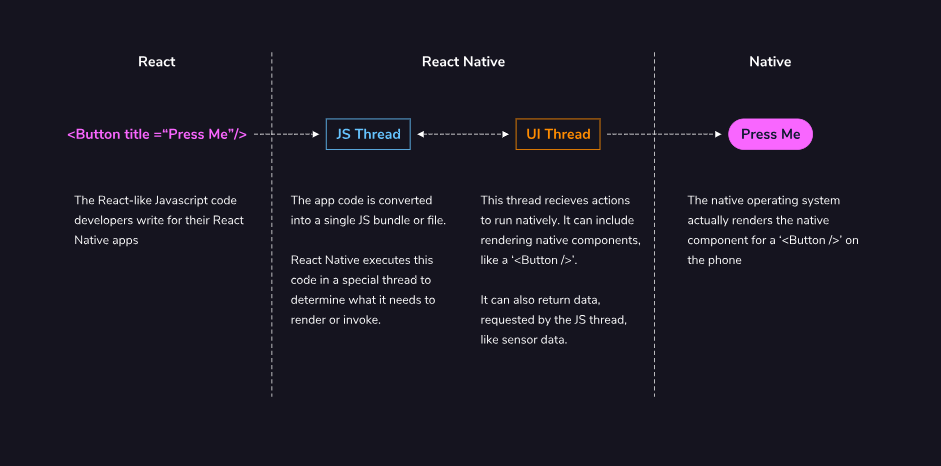
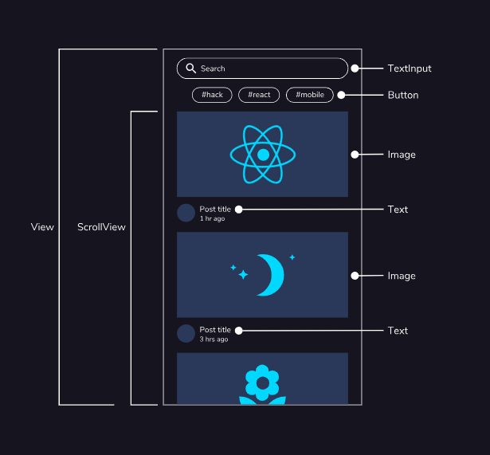
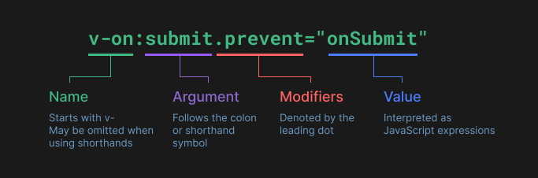
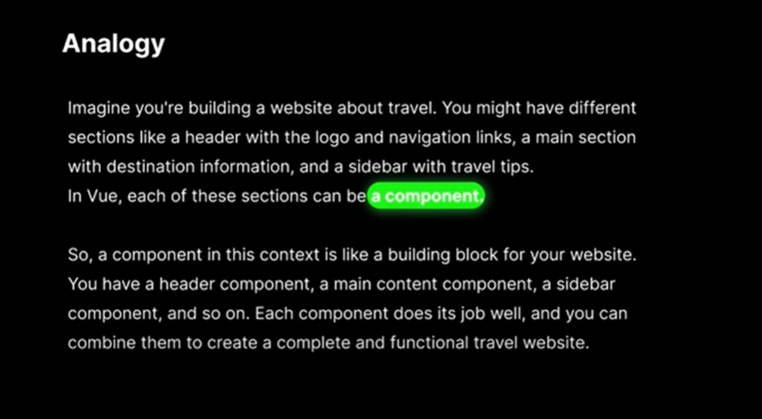

### learning

- [Getting Hired TOP](https://www.theodinproject.com/paths/full-stack-javascript/courses/getting-hired)

- [NodeJS](https://www.theodinproject.com/paths/full-stack-javascript/courses/nodejs)

- [Javascript](https://www.theodinproject.com/paths/full-stack-javascript/courses/javascript)

- [HTML and CSS](https://www.theodinproject.com/paths/full-stack-javascript/courses/intermediate-html-and-css)

- [Advanced HTML and CSS](https://www.theodinproject.com/paths/full-stack-javascript/courses/advanced-html-and-css)

- [React](https://www.theodinproject.com/paths/full-stack-javascript/courses/react)

```

## 8/5/2024

**z** sounds like [ts]
**ei** sounds like [ay]
**w** what? => was?
double consonant is pronounced faster eg: ll
**r** as a rolled throaty gurgling [rrr]
or a short reduced [ah] sound when at the end of the word
In **v**, there are two sounds. One is original german words, F and next one is borrowed words, W.
IE pronounces [eee] => long slow e
**s** at the beginning of a word is pronounced as [z]
otherwise **s** is pronounced as [s]
**st** is pronounced as [sht]
**sp** is pronounced as [shp]
**ss** is used after a short vowel Eg. essen
**ß** is used after a long vowel Eg. Straße
**H** is silent in German when standing alone, except at the beginning of a word
**Ch** is pronounced as [hh]
**SCH** is pronounced as [sh]
**TSCH** is pronounced as [ch]

Vocabulary
null
eins
Zwei
drei
vier
fünf
sechs
sieben
acht
neun
zehn
elf
zwölf

---

if we store the grade of 89.56789% in a DECIMAL column with a precision of 6 and a scale of 4, it would be stored as 89.5679

SQL data types are important for database design
**VARCHAR** data type is ideal for storing student names
Variable-length data type, only stores actual length of data entered
**INT** data type is ideal for storing student ages
Can store whole numbers
Numeric data type, can be used for mathematical operations
**DECIMAL** data type is ideal for storing student grades
Can store fixed-point numbers with specified precision and scale
Can store up to 38 digits of precision

## 9/5/2024

https://spiral-clematis-e11.notion.site/250-Free-English-Resources-78e95be00f874914927bb70a9912b180

https://www.germanwithjay.com/starterpack

---

[5/10/2024]
Mein Name ist... - My name is...
Wie ist dein Name? - What is your name?
Ich heiße... - My name is...
Wie heißt du? - What is your name?
Wie heißen sie? (formal)

der Name
der Vorname - first name
der Nachname - last name
heißen - to be called
dein - your

Sie -
older
higher position
showing respect

𝚗𝚠𝚒𝚗, [5/10/2024 9:38 AM]
Wie heißen Sie? - What is your name? (formal)
Wer bist du? - Who are you? (informal)
Wer sind Sie? - Who are you? (formal)
Wer ist das? - Who is that?
Ich weiß nicht. - I don't know.

der Mann - the man
die Frau - the woman

Woher kommst du? - Where are you from? (informal)
Ich komme aus - I am from...
aus den Vereinigten Staaten - from the United States
aus der Schweiz
aus der Türkei
aus den Niederlanden

gut - good
sehr gut - very good
prima - great
schlecht - bad
sehr schlecht
soso - average
Nicht schlecht, und dir?
gehts = es geht
Wie ghets? how it is going?
Wie geht es Ihnen? - How are you? (formal)
Wie geht es dir? - How are you? (informal)

https://qr.ae/psOf2K

### book

life is a comedy for those who think and a tragedy for those who feel

batcher knife
confronation
subdued - (of a person or their manner) quiet and rather reflective or depressed -> subdued colors, subdued voice
psychotic
infuriate
irrational - why are you doing smth so irratinal? so downright dumb?
downright = absolute, total -> downright genuis!
unbridled - uncontrolled -> unbridled passion
unbridled ambition
unbridled enthusiasm
unbridled joy
unbridled creativity
unbridled energy
unruly - uncontrolled -> unruly children
unerringly - without making mistakes -> to predict unerringly
erringly - making mistakes -> erringly predicted
menial - boring, repetitive, low paid -> menial job
menial task
widespread - common, popular -> widespread support
widespread use
dwarfed - made to seem small -> dwarfed by the mountains, dwarfed by the skyscrapers
gratification - satisfaction -> instant gratification, delayed gratification
swamping - overwhelming -> swamping the market
vicissitudes - changes, ups and downs -> vicissitudes of life
turmoil - chaos, confusion -> political turmoil, emotional turmoil
adept - skilled, expert -> adept at playing guitar
meta-ability - ability to learn new abilities -> meta-ability to learn new languages
meta-learning - learning how to learn -> meta-learning how to learn new languages
meta-cognition - thinking about thinking -> meta-cognition about learning new languages
foster - encourage, promote -> foster creativity, foster innovation
casual observer - a person who happens by chance to see something, but is not closely involved in it: To a casual observer, everything might appear normal
wallflower - a shy person who stands alone near the wall at social events: She was a wallflower at the party, too shy to talk to anyone.
dissipate - disappear, vanish -> the fog dissipated, the anger dissipated
dissipate energy
gregarious - sociable, outgoing -> gregarious person, gregarious personality

https://www.similarweb.com/

Wer? - Who?
Wie? - How?
Woher? - Where from?
Wo? - Where?
Was? - What?
Wie bitte? - Excuse me

"Wie ist dein Name?' would literally be translated as 'How is your
name?'. But since that sounds very silly in English, we translate it as 'What
is your name?'."

---

ich
du
er, sie, es
wir
ihr
sie
Sie
duzen
siezen
Du kannst mich duzen.

Once a day, one part of it
https://youtu.be/zMO9Ew8n7MM?si=uko6zmJ9sSGqhOm1

---

https://www.heylama.com/blog/free-online-german-language-courses-from-a1-to-c1

### Present tense

kochen - to cook
en - infinitive ending

ich - e
du - st
er, sie, es - t
wir - en
ihr - t
sie, Sie - en

danke - thank you
bitte - you are welcome, here you go
danke schön - thank you very much
danke sehr - thanks a lot
tut mir leid - I am sorry
entschuldigung - excuse me

write down the words I learnt
danke
danke schön
danke sehr
bitte
bitte schon
bitte sehr
gern geschehen
tut mir leid
enstchuldingung
nichts zu danken

https://www.linguee.com/

---

Job Interview English: Get Your Dream Job
Tips: Aim high - believe in yourself
Tips: Be yourself
Tips: Examples - show > tell, use what you know
Tips: Avoid misunderstanding => understand 100%, will make you hurt
Tips: don't memorize - It makes your sound fake
Tips: Being Memorable, be active, unique
Building your resume tips:

1. Clear and simple
2. Key info is easy to see
3. Info is relevant
4. Templates are ok
5. Spelling, punctuation = perfect

Getting the Interview: Following Up
Basic Questions: Explaining Strengths
Basic Questions: Explaining Weaknesses

- tell me about your weakness
- I am not good at
- I am not very good at
  I lack experience in

---

# 13/5/24

## Need time management

https://youtu.be/JQaQmsJIHJU?si=O-SnujwAo-aFqJge

---

die Mutter - mother
der Vater - father
die Eltern - parents
der Mann - husband
die Frau - wife
die kinder - kids
der sohn - son
die Tochter - daughter
der burder - brother
die Schwester - sister
die Großmutter, die Oma - grandmother
der Großvater,der Opa - grandfather
die Großeltern - grandparents
die Geschwister - siblings
die Tante - aunt
der Onkel - uncle
die Cousine - cousin (female)
der Cousin - cousin (male)

---

https://learngerman.dw.com/de/nicos-weg/c-36519687

https://docs.google.com/document/d/1J5PJK0qStw2DHQHdRHuKIfq_bJrZkFarQVT7fkz13tg/edit

der - masuline
die - feminine
das - neutral
die - plural

## der masculine

**for male people and professions**
der Vater
der Bruder
der Arzt - doctor

**weekdays, months and seasons**
der Montag
der Januar
der Sommer

**Words that end with -er**
der Computer
der Lehrer - teacher
der Koffer - suitcase

**Cars and alcoholic drinks**
der BMW
der Whiskey
der Wein - wine
Exception: das Bier - beer

## Die feminine

**for female people and professions**
die Mutter
die Schwester
die Ärztin - doctor

**Words ending in -heit and -keit**
die Freiheit - freedom
die Möglichkeit - possibility
die Schwierigkeit - difficulty

**words ending in -schaft**
die Freundschaft - friendship
die Mannschaft - team

**Words ending in -ung**
die Übung - exercise

**words ending with -ur**
die Natur - nature

**words ending with -e**
die Lampe - lamp
die Tasche - bag

### das neutral

**all the words that end in -chen**
das Mädchen - girl

**all the words that end in -lein**
das Fräulein - miss

**Most Latin based words**
das Zentrum - center
das Hotel - hotel


## Mein vs Meine


verb "sein" (to be):
• ich bin
• du bist
• er, sie, es ist
• wir sind
• ihr seid
• sie sind
• Sie sind

die sprache - language schpraa·cha
sprechen - to speak, talk

Welche Sprachen sprichst du? - What languages do you speak?

---

## Master Native English | Speaking Skills, Grammar, and More

Keep in mind
• Notes
• practice

physical
nonphyiscal
atmosphere
cottage - a small simple house, typically one near a lake or beach
chimney - a tall pipe used to carry smoke out of a building
four-beautiful-doll - needn't add "s" after "doll" because adj can't be pulral

• I have a black 1990 calssial guiter with a white pickguard

---

# 14/5/24

## Next.js font

Next.js automatically optimizes fonts in the application when you use the next/font module. It downloads font files at build time and hosts them with your other static assets. This means when a user visits your application, there are no additional network requests for fonts which would impact performance.

---

```

import { Inter } from 'next/font/google';

export const inter = Inter({ subsets: ['latin'] });

what is subset?
By using a subset, you can reduce the size of the font file that needs to be loaded, which can improve the performance and loading times of your application.

"Inter({ subsets: ['latin'] })" returns an object which is contained className. So we use like that

<body className={`${inter.className} antialiased`}>{children}</body>

```

## The `<Image>` component

Preventing layout shift automatically when images are loading.
Resizing images to avoid shipping large images to devices with a smaller viewport.
Lazy loading images by default (images load as they enter the viewport).
Serving images in modern formats, like WebP and AVIF, when the browser supports it.

quality

quality={75} // {number 1-100}
The quality of the optimized image, an integer between 1 and 100, where 100 is the best quality and therefore largest file size. Defaults to 75

## That is called root segment, segment, leaf segment


## Link (import Link from 'next/link')

Next.js automatically prefetches the code for the linked route in the background. By the time the user clicks the link, the code for the destination page will already be loaded in the background, and this is what makes the page transition near-instant!

Server components allow you fetch data directly from your database.

---

- [Next.js Documentation](https://nextjs.org/docs)
- [Next.js Learn](https://nextjs.org/learn)
- [Next.js Blogs](https://nextjs.org/blog)

### What does `asChild` means?

Without asChild: The component's default HTML element gets its styles and behaviors.
With asChild: Any React element passed as a child gets the component's styles and behaviors.
So, asChild lets you apply a component's styles and behaviors to a different HTML element or custom component.

Why might static rendering not be a good fit for a dashboard app?
Because the application will not reflect the latest data changes
When your data updates, you want to show the latest changes in your dashboard. Static Rendering is not a good fit for this use case.

## What is Static Rendering?

Faster Websites
Reduced Server Load
SEO

## What is Dynamic Rendering?

Real-Time Data
User-Specific Content
Request Time information

```

export async function fetchLatestInvoices() {
noStore();
// ...
}

```

"Should not be cached" means responses should not be stored due to:

- Sensitive information (e.g., passwords).
- Dynamic data (e.g., stock prices).
- User-specific data (e.g., personalized info).
- Session-specific data (e.g., shopping carts).

Use `no-store` to prevent caching and ensure up-to-date data from the server.

Streaming in Next.js works with React's component model:

At the page level with loading.tsx.
For specific components with <Suspense>.

## useSearchParams, usePathname

useSearchParams- For example, the search params for this URL /dashboard/invoices?page=1&query=pending would look like this: {page: '1', query: 'pending'}.
usePathname - For example, for the route /dashboard/invoices, usePathname would return '/dashboard/invoices'

## defaultValue vs. value / Controlled vs. Uncontrolled

If you're using state to manage the value of an input, you'd use the value attribute to make it a controlled component. This means React would manage the input's state.

However, since you're not using state, you can use defaultValue. This means the native input will manage its own state. This is okay since you're saving the search query to the URL instead of state.

---

## useSearchParams() VS searchParams

Use `useSearchParams()` for client-side access to avoid unnecessary server requests. Use the `searchParams` prop for server-side components to fetch data directly.

## Debouncing

Debouncing limits how often a function runs. It starts a timer on event trigger (e.g., keystroke). If another event occurs before the timer ends, the timer resets. The function runs only when the timer completes without interruption. By debouncing, you can reduce the number of requests sent to your database, thus saving resources.

You can use "use-debounce"

## What is wireframe vs UI?

In summary, a wireframe is a blueprint of the structure and layout of a website or application, while UI design is the process of designing the visual elements and interactions of the user interface.

## Gird

The CSS Grid is useful for two-dimensional layout, providing tools for aligning elements across rows and columns, while the CSS Flexbox is useful for positioning items in a one-dimensional layout.

```

<div class="container">
  <div class="item">Item 1</div>
  <div class="item">Item 2</div>
  <div class="item">Item 3</div>
  <div class="item">Item 4</div>
  <div class="item">Item 5</div>
  <div class="item">Item 6</div>
</div>

.container {
display: grid;
grid-template-columns: repeat(3, 1fr);
grid-template-rows: repeat(2, 150px);
grid-gap: 10px;
}

```

## Flexbox

```

<div class="container">
  <div class="item">Item 1</div>
  <div class="item">Item 2</div>
  <div class="item">Item 3</div>
</div>

.container {
display: flex;
justify-content: space-between;
}

# Learn Advanced React

## Table of Contents

1. [Effect Hooks](#effect-hooks)
2. [Prop Drilling](#prop-drilling)
3. [Context API](#context-api)
4. [React Error Boundaries](#react-error-boundaries)
5. [Higher-Order Components](#higher-order-components)
6. [React Optimization](#react-optimization)
7. [React Testing](#react-testing)
8. [JavaScript Essentials](#javascript-essentials)

## Effect Hooks

Effect hooks are useful for “side effects” such as fetching data or reacting to state changes. They allow you to perform operations that need to happen outside of the React rendering process.

## Prop Drilling

Prop drilling is the process of passing data from a high-level component down through middle-level components to a low-level component. This can lead to less maintainable and harder-to-read code.

## Context API

The Context API is used to avoid prop drilling and unnecessary passing of props. It allows you to share state across multiple components without having to pass props down manually at every level.

### Key Concepts

- **Prop Drilling**: Passing data through multiple components.
- **Context**: Provides shared state to child components, avoiding prop drilling.
- **Provider Component**: Wraps child components and provides access to state.
- **Consumer Components**: Subscribe to context value using the `useContext()` hook.
- **State Management**: Providers can hold state and state updater functions.
- **Alternatives**: Consider other state management options like Redux, `useReducer`, or `useState`.

## React Error Boundaries

Error boundaries catch JavaScript errors anywhere in their child component tree, log those errors, and display a fallback UI instead of the component tree that crashed.

### Implementing Error Boundaries

```jsx
import { ErrorBoundary } from "react-error-boundary";

function ErrorFallback({ error, resetErrorBoundary }) {
  return (
    <div>
      <h2>An error occurred in the app!!</h2>
      <p>Error: {error.message}</p>
      <button onClick={resetErrorBoundary}>Reset</button>
    </div>
  );
}

function App() {
  return (
    <ErrorBoundary onError={logError} FallbackComponent={ErrorFallback}>
      <MyComponent />
    </ErrorBoundary>
  );
}
```

### Passing Props to Fallback Components

```jsx
function ErrorFallback({ error, resetErrorBoundary, newProp }) {
  // Handle the error / resetErrorBoundary logic...
  // But now we also have the newProp value!
}

// Later in some rendered JSX...
<ErrorBoundary
  FallbackComponent={(props) => (
    <ErrorFallback {...props} newProp={"foo"} />
  )}
>
```

Error boundaries can catch errors during rendering, in lifecycle methods, and in constructors of the whole tree below them. They do not catch errors for event handlers, asynchronous code, server-side rendering, or errors thrown in the error boundary itself (rather than its children).

### Example

```jsx
function ErrorFallback({ error, resetErrorBoundary, newMessage }) {
  const handleReset = () => {
    resetErrorBoundary();
  };

  return (
    <div>
      <p>{newMessage || "Oops, an error occurred!"}</p>
      <p>Error details: {error.message}</p>
      <button onClick={handleReset}>Reset</button>
    </div>
  );
}
```

### Usage

```jsx
import React from "react";
import { logError } from "./error-logging-service";

export default class ErrorBoundary extends React.Component {
  constructor(props) {
    super(props);
    this.state = { error: null };
    this.reset = this.reset.bind(this);
  }

  reset() {
    this.setState({ error: null });
  }

  static getDerivedStateFromError(error) {
    return { error };
  }

  componentDidCatch(error, errorInfo) {
    logError(error, errorInfo);
  }

  render() {
    if (this.state.error) {
      return (
        <div className="error">
          <h2>An error was detected!</h2>
          <button onClick={this.reset}>Reset</button>
        </div>
      );
    }
    return this.props.children;
  }
}
```

## Higher-Order Components

A higher-order component (HOC) is a design pattern where a function takes a component and returns a new component with added functionality. HOCs are used for code reuse, logic, and bootstrap abstraction in React.

## React Optimization

Optimizing React applications involves using hooks like `useMemo` and `useCallback` to memoize values and functions, reducing unnecessary re-renders.

### Example with `useMemo`

```jsx
import React, { useState, useMemo } from "react";

function EvenNumbersComponent() {
  const [numbers, setNumbers] = useState([1, 2, 3, 4, 5, 6, 7, 8, 9, 10]);

  const evenNumbers = useMemo(() => {
    return numbers.filter((number) => number % 2 === 0);
  }, [numbers]);

  return (
    <div>
      Even Numbers: {evenNumbers.join(", ")}
      <button onClick={() => setNumbers([2, 4, 6, 8, 10, 12, 14, 16, 18, 20])}>
        Update Numbers
      </button>
    </div>
  );
}
```

### Example with `useCallback`

```jsx
import React, { useState, useCallback } from "react";

function ParentComponent() {
  const [count, setCount] = useState(0);

  const increment = useCallback(() => {
    setCount((prevCount) => prevCount + 1);
  }, []);

  return <ChildComponent onIncrement={increment} />;
}

function ChildComponent({ onIncrement }) {
  return <button onClick={onIncrement}>Increment</button>;
}
```

## React Testing

React Testing Library (RTL) is a library for testing React components by focusing on interactions and DOM elements rather than component internals.

### File Structure

```
src/
└── Button/
    ├── Button.js
    └── Button.test.js
```

### Jest Matchers

- `.toBe()` is used to compare simple data types.
- `.toEqual()` is used for deep equality comparisons.

### Example with Jest

```jsx
// file: recipes.test.js
import { getIngredients } from "./recipes.js";

it("Gets only the ingredients list for Pesto", () => {
  const pestoRecipe = {
    Basil: "2 cups",
    "Pine Nuts": "2 tablespoons",
    Garlic: "2 cloves",
    "Olive Oil": "0.5 cups",
    "Grated Parmesan": "0.5 cups",
  };
  const expectedIngredients = [
    "Basil",
    "Pine Nuts",
    "Garlic",
    "Olive Oil",
    "Grated Parmesan",
  ];
  const actualIngredients = getIngredients(pestoRecipe);
  expect(actualIngredients).toEqual(expectedIngredients);
});
```

### Testing Async Code with Jest

#### Using `done()`

```jsx
it("correctly fetches a list of countries", (done) => {
  const inputLanguageCode = "es";
  const expectedValue = "Argentina";

  countryListLookup(inputLanguageCode, (result) => {
    try {
      expect(result).toBeDefined();
      done();
    } catch (error) {
      done(error);
    }
  });
});
```

#### Using `async/await`

```jsx
it("correctly fetches a list of countries", async () => {
  const inputLanguageCode = "es";
  const expectedValue = "Argentina";

  const actualValue = await countryListLookup(inputLanguageCode);
  expect(actualValue).toContain(expectedValue);
});
```

### When to Use `done()` and `async/await`

- Use `done()` for asynchronous code that uses callbacks.
- Use `async/await` for code that returns Promises.

## JavaScript Essentials

### Null and Undefined

- `undefined` means a variable has been declared but not yet assigned a value.
- `null` is an assignment value that represents no value.

### Example

```jsx
let finishCourseTime = undefined; // Should have a value, but it's undefined now
let finishStudyingDate = null; // No value here

function help() {
  // No return statement
}
console.log(help()); // Outputs
```

#### A function also outputs undefined when no value is returned.

```

function help() {
// no return statement
}
console.log(help());

```

#### An empty object can be initialized and the properties added to the object. Run the code below to see it in action:

```

const person = {};
person.firstName = "John";
person.lastName = "Doe";
person.age = 50;
person.eyeColor = "blue";

console.log(person);

```

`{ firstName: 'John', lastName: 'Doe', age: 50, eyeColor: 'blue' }`

```sh
console.log(11 % 3); // Prints 2
console.log(9 / 3); // Prints 3
```

### JS methods

```sh
  // Array Method
  arr.map(callback);

  // String Method
  str.includes(substring);

  // Object Method
  Object.keys(obj);

  // Function Method
  func.bind(thisArg);

  // DOM Method
  document.querySelector(selector);
```

` methods are actions we can perform`

## What is the method?

methods are actions we can perform

` Math.random() generates a random number between 0 and 1.`

## String Interpolation

```sh
const myPet = 'armadillo';
console.log(`I own a pet ${myPet}.`);
```

## What is HTTP?

`The Hypertext Transfer Protocol (HTTP) is the foundation of the World Wide Web, and is used to load webpages using hypertext links.`

```sh
Hypertext Markup Language (HTML) and Cascading Style Sheets (CSS). HTML tells a browser how to display the content of web pages, while CSS styles that content. Bootstrap is a helpful framework for managing HTML and CSS.
JavaScript (JS). JS makes web pages interactive.
```

## Node is a “JavaScript runtime”

Node is an asynchronous event driven JavaScript runtime

### Normal Functions (Named Functions)

```sh
function funkyFunction(music, isWhiteBoy) {
  if (isWhiteBoy) {
    console.log('Play: ' +  music);
  }
}
```

### Anonymous Functions

```sh
const funkyFunction = function(music, isWhiteBoy) {
  if (isWhiteBoy) {
    console.log('Play: ' +  music);
  }
}
```

### Arrow Functions

```sh
const playThe = (funky) => {
  return funky + " music";
}

const playThe = funky => {
  return funky + " music";
}

const playThe = funky => funky + " music";

// You can call all of these functions like: `playThe('blues')`
```

## What is callbacks?

Callbacks are just functions passed into other functions as arguments (as a parameter).

### npm

Node.js’ package ecosystem, npm, is the largest ecosystem of open source libraries in the world.

### What is I/O?

I/O refers to input/output

### Blocking I/O VS Non-blocking I/O

Blocking I/O:

- User2's data request waits until User1's data is printed.
- Web servers would need a new thread per user.
- JavaScript is single-threaded, making this inefficient.

Non-blocking I/O:

- User2's request starts without waiting for User1's response.
- Initiates multiple requests in parallel.
- Eliminates the need for multi-threading, handling multiple requests simultaneously.

# Nodejs

`Node.js runs the V8 JavaScript engine. Node.js has a fantastic standard library, including first-class support for networking. Node is an asynchronous event driven JavaScript runtime.`

```sh
const http = require('http');

const server = http.createServer((req, res) => {
  res.statusCode = 200;
  res.setHeader('Content-Type', 'text/plain');
  res.end('Hello World');
});
```

- `createServer` => That is called predefined function

### anonymous function

```sh
(req, res) => {
  res.statusCode = 200;
  res.setHeader('Content-Type', 'text/plain');
  res.end('Hello World');
}
```

### Why first-class support for networking is nodejs?

Node.js' networking features are deemed "first-class" due to their seamless integration, efficiency, and role as core components within Node.js applications, all achieved without external library dependencies.

### Why do we set Content-Type?

```sh
res.setHeader('Content-Type', 'text/plain');
```

Setting the Content-Type header with res.setHeader('Content-Type', 'text/plain') informs the client about the type of content being sent in the response. This helps the client interpret the data correctly. For example, specifying text/plain indicates that the content is plain text. This is crucial for proper rendering and interpretation by clients, ensuring a seamless user experience.

and we close the response, adding the content as an argument to end():

```sh
res.end('Hello World\n');
```

---

`text/html`: Used for HTML content, indicating that the response body contains HTML markup.
`application/json`: Indicates that the response body contains JSON data.
`image/jpeg, image/png, image/gif`: Specifies image formats such as JPEG, PNG, or GIF.
`audio/mpeg, audio/wav`: Denotes audio formats like MP3 or WAV.
`video/mp4, video/webm`: Indicates video formats such as MP4 or WebM.
`application/pdf`: Specifies that the response body contains a PDF document.

### What is npm?

npm is the standard package manager for Node.js.

### What do npm do?

npm manages downloads of dependencies of your project.

### What is the different between `dependencies and devDependencies`?

Dependencies are runtime essentials, like lodash in Node.js, bundled for production.
devDependencies, like Jest, are dev tools excluded from production, keeping bundles lean.

```json
{
  "dependencies": {
    "lodash": "^4.17.21"
  },
  "devDependencies": {
    "jest": "^27.0.6"
  }
}
```

## npm Install Flags: Managing Dependencies in package.json

`--save-dev` installs and adds the entry to the package.json file devDependencies

`--no-save` installs but does not add the entry to the package.json file dependencies

`--save-optional` installs and adds the entry to the package.json file optionalDependencies

`--no-optional` will prevent optional dependencies from being installed

```sh
Shorthands of the flags can also be used:

-S: --save
-D: --save-dev
-O: --save-optional
```

### Question: What happens when you run `npm install` without any flags, in terms of optional dependencies?

Answer: When you run `npm install` without any flags, both required and optional dependencies are installed by default. However, optional dependencies can be excluded from installation later by using the `npm install --no-optional` command.

### Restart the application automatically

```sh
node --watch app.js
```

### File System

The fs module in Node.js provides extensive file system functionality. It's part of the Node.js core, requiring no installation. Key methods include:

- fs.access(): check if the file exists and Node.js can access it with its permissions
- fs.appendFile(): append data to a file. If the file does not exist, it's created
- fs.chmod(): change the permissions of a file specified by the filename passed. Related: fs.lchmod(), fs.fchmod()
- fs.chown(): change the owner and group of a file specified by the filename passed. Related: fs.fchown(), fs.lchown()
- fs.close(): close a file descriptor
- fs.copyFile(): copies a file
- fs.createReadStream(): create a readable file stream
- fs.createWriteStream(): create a writable file stream
- fs.link(): create a new hard link to a file
- fs.mkdir(): create a new folder
- fs.mkdtemp(): create a temporary directory
- fs.open(): opens the file and returns a file descriptor to allow file manipulation
- fs.readdir(): read the contents of a directory
- fs.readFile(): read the content of a file. Related: fs.read()
- fs.readlink(): read the value of a symbolic link
- fs.realpath(): resolve relative file path pointers (., ..) to the full path
- fs.rename(): rename a file or folder
- fs.rmdir(): remove a folder
- fs.stat(): returns the status of the file identified by the filename passed. Related: fs.fstat(), fs.lstat()
- fs.symlink(): create a new symbolic link to a file
- fs.truncate(): truncate to the specified length the file identified by the filename passed. Related: fs.ftruncate()
- fs.unlink(): remove a file or a symbolic link
- fs.unwatchFile(): stop watching for changes on a file
- fs.utimes(): change the timestamp of the file identified by the filename passed. Related: fs.futimes()
- fs.watchFile(): start watching for changes on a file. Related: fs.watch()
- fs.writeFile(): write data to a file. Related: fs.write()

Methods are asynchronous by default, but you can add Sync if you want it synchronous.

For example:

```sh
fs.rename()
fs.renameSync()
fs.write()
fs.writeSync()
```

````plaintext
# Node.js File System Module (fs)

The fs module in Node.js provides extensive file system functionality. It offers both asynchronous and synchronous methods for interacting with the file system.

## Asynchronous Usage

```javascript
const fs = require('fs');

// Example with fs.rename()
fs.rename('before.json', 'after.json', err => {
  if (err) {
    return console.error(err);
  }

  // Operation completed
});
````

## Synchronous Usage

```javascript
const fs = require("fs");

// Example with fs.renameSync()
try {
  fs.renameSync("before.json", "after.json");
  // Operation completed
} catch (err) {
  console.error(err);
}
```

## Promise-Based API (fs/promises)

To avoid callback hell, you can use the promise-based API provided by the `fs/promises` module.

```javascript
const fs = require("fs/promises");

async function example() {
  const fileName = "/Users/joe/test.txt";
  try {
    const data = await fs.readFile(fileName, "utf8");
    console.log(data);
    const content = "Some content!";
    await fs.writeFile(fileName, content);
    console.log("Wrote some content!");
    const newData = await fs.readFile(fileName, "utf8");
    console.log(newData);
  } catch (err) {
    console.log(err);
  }
}

example();
```

By leveraging promises, you can write cleaner and more readable code, avoiding the pitfalls of callback hell.

````plaintext
# Node.js EventEmitter

Node.js offers the `events` module to handle events similar to the browser. The `EventEmitter` class provides methods to work with events.

Initialization:
```javascript
const EventEmitter = require('node:events');
const eventEmitter = new EventEmitter();
````

Key Methods:

- `emit`: triggers an event
- `on`: adds a callback for an event

Example:

```javascript
eventEmitter.on("start", () => {
  console.log("started");
});
eventEmitter.emit("start");
```

Passing Arguments:

```javascript
eventEmitter.on("start", (number) => {
  console.log(`started ${number}`);
});
eventEmitter.emit("start", 23);

// Multiple arguments
eventEmitter.on("start", (start, end) => {
  console.log(`started from ${start} to ${end}`);
});
eventEmitter.emit("start", 1, 100);
```

````plaintext
# Node.js Modules

To include a module, use the `require()` function with the module name:

```javascript
var http = require('http');
````

Now your application has access to the HTTP module and can create a server:

```javascript
http
  .createServer(function (req, res) {
    res.writeHead(200, { "Content-Type": "text/html" });
    res.end("Hello World!");
  })
  .listen(8080);
```

### Read the debugging blog for nodejs

https://web.archive.org/web/20230923074524/https://www.section.io/engineering-education/debug-node-devtools/

# 23/6/2024

### Expressjs


### Learning React Native

#### Learn ES6

https://babeljs.io/docs/learn/

Expo Application Services (EAS)

## Start with expo

npx create-expo-app@latest

## Codecademy react native course

Mobile devices like smartphones and tablets are ubiquitous. Cisco forecasts 5.7 billion mobile users by 2023. Major companies, including Codecademy, offer mobile apps for their services.

The two primary platforms are Android and iOS, comprising 99.4% of all devices. Developing apps for both requires platform-specific expertise, multiple programming languages, toolsets, and often a Mac for iOS development.

## Best web

https://www.reactnative.express/
https://react-native-10x-faster.com/
https://docs.expo.dev/versions/latest/
https://reactnative.dev/docs/components-and-apis

---

core components
https://www.codecademy.com/learn/learn-react-native/modules/core-components-react-native/cheatsheet

---

**Expo and React Native**

Expo simplifies the development of React Native apps, offering tools to build, deploy, and iterate quickly without requiring deep native knowledge.

Key components:

- **Expo Go:** App for viewing your app in development.
- **Expo CLI:** Tool for creating and managing apps.
- **Expo SDK:** Modular packages for accessing native APIs (e.g., Camera, Notifications).
- **Expo Snack:** Web-based playground for writing and running React Native snippets.

Expo is often recommended for its ease of use and flexibility, allowing developers to eject back to pure React Native if needed.

## Native Rendering

**React Native Rendering Process:**

- **React:** Developers write React-like JavaScript code.
- **JS Thread:** The code is bundled into a single JS file and executed in a special thread to determine rendering and actions.
- **UI Thread:** Receives instructions to render native components (e.g., `<Button />`) and return data (e.g., sensor data).
- **Native:** The operating system renders the native component on the device.
  

Human Interface Guidelines (HIG) (Ios)
https://developer.apple.com/design/human-interface-guidelines/

Material Design guidelines (Android)
https://m3.material.io/

---

React Native is a library that uses React for mobile app development to create performant apps with JavaScript.
Expo is a platform for universal React apps that contains React Native and helps you iterate fast, without any native platform knowledge.
Components in React Native have a native component counterpart that is rendered on the native platform.

---

### Steps to Develop Expo Apps on Your Own Computer

1. **Install Node.js and a Code Editor**:

   - Download and install Node.js from the [official Node.js website](https://nodejs.org/).
   - Choose and install a code editor, such as [Visual Studio Code](https://code.visualstudio.com/), [Atom](https://atom.io/), or [Sublime Text](https://www.sublimetext.com/).

2. **Install Expo Command-Line Tools**:
   Open your terminal or command prompt and run the following command to install the Expo CLI globally using npm:

   ```bash
   npm install -g expo-cli
   ```

3. **Create a New Expo Project**:
   Use the Expo CLI to initialize a new project. Run the following command and follow the prompts to create a new project named "hello-world":

   ```bash
   expo init hello-world
   ```

4. **Preview Your App on Your Smartphone**:
   - Install the Expo Go app on your Android or iOS device from the Google Play Store or Apple App Store.
   - Launch the Expo Go app on your smartphone.
   - In your terminal, navigate to your project directory:
     ```bash
     cd hello-world
     ```
   - Start the Expo development server:
     ```bash
     expo start
     ```
   - Scan the QR code displayed in your terminal or browser with the Expo Go app to preview your app on your smartphone.

### Summary

By following these steps, you can set up a development environment for Expo apps on your computer, create a new project, and preview it on your mobile device.

---



---

### Dimensions in React Native (Height and width)

#### Fixed Dimensions

- **Usage**: Set constant width and height.

  ```javascript
  import React from "react";
  import { View } from "react-native";

  const FixedDimensionsBasics = () => {
    return (
      <View>
        <View
          style={{ width: 50, height: 50, backgroundColor: "powderblue" }}
        />
        <View style={{ width: 100, height: 100, backgroundColor: "skyblue" }} />
        <View
          style={{ width: 150, height: 150, backgroundColor: "steelblue" }}
        />
      </View>
    );
  };

  export default FixedDimensionsBasics;
  ```

#### Flex Dimensions

- **Usage**: Expand/shrink based on available space.

  ```javascript
  import React from "react";
  import { View } from "react-native";

  const FlexDimensionsBasics = () => {
    return (
      <View style={{ flex: 1 }}>
        <View style={{ flex: 1, backgroundColor: "powderblue" }} />
        <View style={{ flex: 2, backgroundColor: "skyblue" }} />
        <View style={{ flex: 3, backgroundColor: "steelblue" }} />
      </View>
    );
  };

  export default FlexDimensionsBasics;
  ```

#### Percentage Dimensions

- **Usage**: Use percentage values for size.

  ```javascript
  import React from "react";
  import { View } from "react-native";

  const PercentageDimensionsBasics = () => {
    return (
      <View style={{ height: "100%" }}>
        <View style={{ height: "15%", backgroundColor: "powderblue" }} />
        <View
          style={{ width: "66%", height: "35%", backgroundColor: "skyblue" }}
        />
        <View
          style={{ width: "33%", height: "50%", backgroundColor: "steelblue" }}
        />
      </View>
    );
  };

  export default PercentageDimensionsBasics;
  ```

### Notes

- **Fixed Dimensions**: Use for components with a constant size.

  - **Example**:
    ```javascript
    <View style={{ width: 50, height: 50 }} />
    ```
  - **Caution**: Physical size may vary across devices.

- **Flex Dimensions**: Use `flex` to expand/shrink based on available space.

  - **Example**:
    ```javascript
    <View style={{ flex: 1 }} />
    ```
  - **Note**: Parent must have defined dimensions.

- **Percentage Dimensions**: Use percentage values to fill a portion of the screen.
  - **Example**:
    ```javascript
    <View style={{ width: "50%", height: "50%" }} />
    ```
  - **Note**: Requires parent with defined size.

By understanding and using fixed, flex, and percentage dimensions, you can effectively control component sizes and layout in React Native.

---

Certainly! Let's break down these flex-related properties in a concise and clear manner:

### flexGrow

- **Definition**: Describes how much space a child component can grow inside its parent container along the main axis.
- **Usage**: A higher flexGrow value means the component can take up more available space.
- **Example**: If one child has flexGrow: 2 and another has flexGrow: 1, the first child will take twice as much space as the second child if there's extra space available.

### flexBasis

- **Definition**: Sets the initial size of a child component in a container along the main axis.
- **Usage**: Similar to setting width for row-oriented containers or height for column-oriented containers.
- **Example**: If a child has flexBasis: 100, it will start with a size of 100 units along the main axis before any flex adjustments are made.

### flexShrink

- **Definition**: Determines how much a child component can shrink inside its parent container along the main axis if there's not enough space.
- **Usage**: Higher flexShrink values allow the component to shrink more.
- **Example**: If one child has flexShrink: 2 and another has flexShrink: 1, the first child will shrink twice as much as the second child if there's not enough space.

### Summary

- **flexGrow**: Controls how much a component can grow.
- **flexBasis**: Sets the initial size of a component.
- **flexShrink**: Determines how much a component can shrink if there's not enough space.

---

### Layout Gaps

- **rowGap**: Sets the gap between rows in an element.
- **columnGap**: Sets the gap between columns in an element.
- **gap**: Shorthand for setting both rowGap and columnGap.

### Width and Height

- **Width**: Specifies the width of an element's content area.
- **Height**: Specifies the height of an element's content area.
- **Values**:
  - **auto**: Automatically adjusts based on content.
  - **pixels**: Defines absolute width/height in pixels.
  - **percentage**: Defines width/height as a percentage of its parent's width/height.

### Absolute & Relative Positioning

- **relative**: Default positioning where the element is positioned relative to the normal layout flow.
- **absolute**: Positioned independently of normal flow, based on top, right, bottom, and left values.

---

1. **Static Image Resources**:

   - Use `require()` to reference static images in your code.
   - Support different screen densities with @2x and @3x suffixes.
   - Images are bundled into the app, reducing app recompilation.

2. **Network Images**:

   - Manually specify dimensions for network images.
   - Use HTTPS to satisfy App Transport Security requirements on iOS.
   - Customize network requests for images with additional properties.

3. **Absolute & Relative Layout**:

   - Understand the difference between relative and absolute positioning.
   - Relative positioning maintains the normal layout flow, while absolute positioning does not.

4. **Background Image via Nesting**:

   - Use `<ImageBackground>` for background images.
   - Ensure to specify width and height style attributes.

5. **Off-thread Decoding**:

   - Image decoding is done in a separate thread, reducing frame drops.

6. **Configuring iOS Image Cache Limits**:
   - Override default image cache limits for better control over image caching.

---

expo-splash-screen

```sh
npx expo install expo-splash-screen
```

A splash screen is a graphical element displaying an image, logo, and software version, typically shown while an app or game is launching.

https://resource.jsmastery.pro/ultimate-react-native-guide

How to create react native with jsx
npx create-expo-app@latest --template
select blank (bare)

---

in react, rafc
in react native, rnfes

**ActivityIndicator**

- Displays a circular loading indicator.

**StatusBar**

- Controls the app's status bar which typically shows time, network info, battery level, etc.

**ScrollView**

- Renders all child components at once, suitable for shorter lists.
- Requires bounded height for proper functioning.
- Use when the content size is reasonably small.

**FlatList**

- Renders items lazily and efficiently.
- Ideal for long lists with dynamic content.
- Supports features like separators, multiple columns, and infinite scroll.

**SafeAreaView**

- Renders content within safe area boundaries of iOS devices.
- Automatically applies padding to accommodate status bars, notches, etc.
- Example:

  ```jsx
  import { SafeAreaView } from "react-native";

  function App() {
    return (
      <SafeAreaView style={{ flex: 1, backgroundColor: "white" }}>
        {/* Your content here */}
      </SafeAreaView>
    );
  }
  ```

**Stack Navigator**

- Foundation for navigating between routes.
- Supports route animations and customization.
- Example usage in Expo:

  ```jsx
  import { Stack } from "expo-router";

  function Layout() {
    return (
      <Stack>
        <Stack.Screen name="Home" component={HomeScreen} />
        <Stack.Screen name="Details" component={DetailsScreen} />
      </Stack>
    );
  }
  ```

**Drawer Navigator**

- Navigation via a drawer from the edge of the screen.
- Allows easy access to different screens.
- Example:

  ```jsx
  import { createDrawerNavigator } from "@react-navigation/drawer";
  import { NavigationContainer } from "@react-navigation/native";

  function App() {
    return (
      <NavigationContainer>
        <Drawer.Navigator>
          <Drawer.Screen name="Home" component={HomeScreen} />
          <Drawer.Screen name="Notifications" component={NotificationsScreen} />
        </Drawer.Navigator>
      </NavigationContainer>
    );
  }
  ```

**Platform-specific Modules**

- Adjusts content based on platform (iOS, Android, web).
- Enhances native experience.
- Example:

  ```jsx
  import { Platform } from "react-native";

  function App() {
    return (
      <React.Fragment>
        {Platform.OS === "web" ? (
          // Web-specific layout
          <WebLayout />
        ) : (
          // Native-specific layout
          <NativeLayout />
        )}
      </React.Fragment>
    );
  }
  ```

## Learning Figma

when you want line height, 16 (font size) \* 1.75

or you can write 175% in line height

it will give you perfect line height

### useTransition

### React `useTransition` Hook

**`useTransition`** is a React Hook that allows you to update the state without blocking the UI, making transitions smoother and improving user experience.

#### Importing `useTransition`

```javascript
import { useTransition } from "react";
```

#### Basic Usage

```javascript
const [isPending, startTransition] = useTransition();
```

- **`isPending`**: A boolean indicating if a transition is in progress.
- **`startTransition`**: A function to mark state updates as transitions.

#### Example

```javascript
import React, { useState, useTransition } from "react";

function TabContainer() {
  const [isPending, startTransition] = useTransition();
  const [tab, setTab] = useState("about");

  function selectTab(nextTab) {
    startTransition(() => {
      setTab(nextTab);
    });
  }

  return (
    <div>
      <button onClick={() => selectTab("about")}>About</button>
      <button onClick={() => selectTab("posts")}>Posts</button>
      <button onClick={() => selectTab("contact")}>Contact</button>
      <div>
        {tab === "about" && <p>About Content</p>}
        {tab === "posts" && <p>Posts Content</p>}
        {tab === "contact" && <p>Contact Content</p>}
      </div>
      {isPending && <p>Loading...</p>}
    </div>
  );
}

export default TabContainer;
```

### How `useTransition` Works

1. **Marking Non-Blocking State Updates**: Use `startTransition` to wrap state updates that should be non-blocking.
2. **Responsive UI**: Keeps the UI responsive even during expensive state updates.

### Usage Scenarios

- **Non-Blocking Transitions**: Prevent the UI from blocking during heavy state updates.
- **Parent Component Updates**: Use `useTransition` in child components to manage updates in parent components.
- **Pending State Visuals**: Display loading indicators while transitions are pending.
- **Suspense-Enabled Routers**: Enhance routers by marking navigations as transitions to avoid loading indicators and improve user experience.

### Troubleshooting

- **Controlled Inputs**: Do not use `useTransition` for controlled inputs.
- **State Updates**: Ensure state updates occur during the `startTransition` call.
- **Async Functions**: Do not use `startTransition` directly with async functions.

#### Example with Error Boundary

```javascript
import React, { useTransition } from "react";
import { ErrorBoundary } from "react-error-boundary";

function AddCommentContainer() {
  return (
    <ErrorBoundary fallback={<p>⚠️Something went wrong</p>}>
      <AddCommentButton />
    </ErrorBoundary>
  );
}

function addComment(comment) {
  if (!comment) throw new Error("Comment is required");
}

function AddCommentButton() {
  const [isPending, startTransition] = useTransition();

  return (
    <button
      disabled={isPending}
      onClick={() => {
        startTransition(() => {
          addComment("This is a comment");
        });
      }}
    >
      Add comment
    </button>
  );
}

export default AddCommentContainer;
```

### Summary

- **`useTransition`** improves user experience by keeping the UI responsive during state updates.
- **Parameters**: `useTransition` takes no parameters.
- **Returns**: An array with `isPending` and `startTransition`.
- **Scope**: `startTransition` marks state updates as transitions.

Use `useTransition` for managing non-blocking updates, showing pending states, and improving complex UI transitions.

# Get-hired notes

### Internship

- to gain experience so better for apply jobs
- make sure it is paid. No one values free from others
  [Thread on “How do I get a Software Internship” from MetaFilter](https://www.wayup.com/s/internships/it/)
  [InternMatch](https://ask.metafilter.com/226621/How-do-I-get-a-software-internship)

# The Odin Project - Get Hired

**up to 80% of all jobs** => not posting online
So make networking

- better to choose quality over quantity
- but it’s still better to choose quality over quantity by seeking companies that you find interesting and have core values you identify with.
- Check Meetup, LinkedIn, and/or Google for local communities focused on a given technology.

### For community

- LinkedIn => [optimize your profile](https://www.samanthaming.com/blog/tips-to-optimize-your-linkedin-profile-for-developers/)
- [X](https://x.com)
- Open Source projects
- [How to use LinkedIn as a developer to get a job in tech](https://www.youtube.com/watch?v=SG5Sb5WTV_g)
- [How to Network: a Guide for Remote Software Developers & Engineers](https://arc.dev/talent-blog/how-to-network-as-remote-developer/)

[Linkedin best practice](https://arc.dev/talent-blog/linkedin-best-practices-for-remote-developers/)

[How to get a job as a web developer](https://web.archive.org/web/20160925155912/http://www.happybearsoftware.com/how-to-get-a-programmer-job.html)

### hiring managers are usually looking for 3 main things:

- Capability
- Motivation
- Fit

# Learning Vue

- **Creating Vue App**:

  - Use `createApp` to start a Vue application.
  - Example:
    ```js
    import { createApp } from "vue";
    const app = createApp({
      /* root component options */
    });
    ```

- **Root Component**:

  - The object passed into `createApp` is a component.
  - Import root component in single-file components:
    ```js
    import App from "./App.vue";
    const app = createApp(App);
    ```

- **Component Tree**:

  - Real applications use a tree of nested, reusable components.
  - Example structure:
    ```
    App (root component)
    ├─ TodoList
    │  └─ TodoItem
    │     ├─ TodoDeleteButton
    │     └─ TodoEditButton
    └─ TodoFooter
       ├─ TodoClearButton
       └─ TodoStatistics
    ```

- **Mounting the App**:

  - Use `.mount(container)` to render the app:
    ```html
    <div id="app"></div>
    ```
    ```js
    app.mount("#app");
    ```

- **In-DOM Root Component Template**:

  - Template can be part of the component or in the mount container:
    ```html
    <div id="app">
      <button @click="count++">{{ count }}</button>
    </div>
    ```
    ```js
    const app = createApp({
      data() {
        return { count: 0 };
      },
    });
    app.mount("#app");
    ```

- **App Configurations**:

  - Configure app-level options using `.config`:
    ```js
    app.config.errorHandler = (err) => {
      /* handle error */
    };
    ```
  - Register app-scoped assets:
    ```js
    app.component("TodoDeleteButton", TodoDeleteButton);
    ```

- **Multiple Application Instances**:

  - Multiple Vue apps can co-exist on the same page:
    ```js
    const app1 = createApp({
      /* ... */
    });
    app1.mount("#container-1");
    const app2 = createApp({
      /* ... */
    });
    app2.mount("#container-2");
    ```

- **API Preference**:

  - Composition API is recommended.
  - Toggle between Options API and Composition API as needed.

- **Declaring Reactive State with `ref()`**:

  - Import and use `ref` to create reactive state:
    ```js
    import { ref } from "vue";
    const count = ref(0);
    ```
  - `ref` returns an object with a `.value` property.

- **Using `ref` in Component**:

  - Declare and return refs in `setup()`:
    ```js
    export default {
      setup() {
        const count = ref(0);
        return { count };
      },
    };
    ```
  - Access `ref` directly in the template without `.value`:
    ```html
    <div>{{ count }}</div>
    <button @click="count++">{{ count }}</button>
    ```

- **Functions and Event Handlers**:

  - Define functions in `setup()` and return them:
    ```js
    export default {
      setup() {
        const count = ref(0);
        function increment() {
          count.value++;
        }
        return { count, increment };
      },
    };
    ```
  - Use functions as event handlers:
    ```html
    <button @click="increment">{{ count }}</button>
    ```

- **`<script setup>` Simplification**:

  - Use `<script setup>` for a concise syntax:

    ```vue
    <script setup>
    import { ref } from "vue";
    const count = ref(0);
    function increment() {
      count.value++;
    }
    </script>

    <template>
      <button @click="increment">{{ count }}</button>
    </template>
    ```

- **Why Use `ref()`**:

  - Enables Vue to track changes and update the DOM automatically.
  - Ref objects allow passing around reactive state.

- **Deep Reactivity**:

  - `ref` makes nested objects/arrays reactive:
    ```js
    const obj = ref({ nested: { count: 0 }, arr: ["foo", "bar"] });
    ```

- **`nextTick()` for DOM Updates**:

  - Ensure DOM updates are completed:
    ```js
    import { nextTick } from "vue";
    async function increment() {
      count.value++;
      await nextTick();
    }
    ```

- **`reactive()` for Reactive Objects**:

  - Make an object reactive:
    ```js
    import { reactive } from "vue";
    const state = reactive({ count: 0 });
    ```

- **Limitations of `reactive()`**:

  - Only works with object types, not primitives.
  - Replacing reactive objects loses reactivity connection.
  - Not destructure-friendly.

- **Ref Unwrapping**:

  - Automatic in templates and reactive objects:
    ```js
    const count = ref(0);
    const state = reactive({ count });
    ```

- **Caveats**:
  - No unwrapping in arrays/collections or nested properties without destructuring:
    ```js
    const books = reactive([ref("Vue 3 Guide")]);
    console.log(books[0].value); // .value needed
    ```

### Only Works with Object Types, Not Primitives

**Example**:

```js
import { reactive } from "vue";

const count = reactive(0); // This will not work as expected
console.log(count); // 0 (not reactive)
```

**Correct Way**:

```js
import { ref } from "vue";

const count = ref(0);
console.log(count.value); // 0 (reactive)
```

### Replacing Reactive Objects Loses Reactivity Connection

**Example**:

```js
import { reactive } from "vue";

let state = reactive({ count: 0 });

// Initial state is reactive
console.log(state.count); // 0

// Replacing the entire object
state = reactive({ count: 1 });

// The original reactive connection is lost
console.log(state.count); // 1 (new reactive object)
```

**Correct Way**:

```js
import { reactive } from "vue";

let state = reactive({ count: 0 });

// Update the existing reactive object
state.count = 1;

console.log(state.count); // 1 (still reactive)
```

### Not Destructure-Friendly

**Example**:

```js
import { reactive } from "vue";

const state = reactive({ count: 0 });

// Destructuring loses reactivity
let { count } = state;
count++;

// Original state is not updated
console.log(state.count); // 0 (reactivity lost)
```

**Correct Way**:

```js
import { reactive } from "vue";

const state = reactive({ count: 0 });

// Use the property directly to retain reactivity
function increment() {
  state.count++;
}

increment();
console.log(state.count); // 1 (reactive)
```

In summary, these examples highlight how `reactive()` is limited to objects, loses its connection when the object is replaced, and is not suitable for destructuring when you want to maintain reactivity. Using `ref()` for primitives and avoiding replacing reactive objects or destructuring their properties ensures reactivity is preserved.

### Components Basics

Components allow us to split the UI into independent and reusable pieces, enabling isolated thinking for each piece. An application is often organized into a tree of nested components, similar to how native HTML elements are nested.

#### Defining a Component

**Single-File Components (SFCs)**:

```vue
<script setup>
import { ref } from "vue";

const count = ref(0);
</script>

<template>
  <button @click="count++">You clicked me {{ count }} times.</button>
</template>
```

- Defined in a `.vue` file.
- Encapsulates JavaScript logic and template in a single file.

**Without a Build Step**:

```js
import { ref } from "vue";

export default {
  setup() {
    const count = ref(0);
    return { count };
  },
  template: `
    <button @click="count++">
      You clicked me {{ count }} times.
    </button>`,
};
```

- Defined as a plain JavaScript object with Vue-specific options.
- Template is inlined as a JavaScript string or referenced by an ID selector.

#### Using a Component

**Local Registration**:

```vue
<script setup>
import ButtonCounter from "./ButtonCounter.vue";
</script>

<template>
  <h1>Here is a child component!</h1>
  <ButtonCounter />
</template>
```

- Import child components in the parent component.
- Automatically available in the template with `<script setup>`.

**Global Registration**:

```js
import { createApp } from "vue";
import ButtonCounter from "./ButtonCounter.vue";

const app = createApp({});
app.component("ButtonCounter", ButtonCounter);
app.mount("#app");
```

- Makes a component available to all components in the app without importing it.

**Multiple Instances**:

```vue
<template>
  <h1>Here are many child components!</h1>
  <ButtonCounter />
  <ButtonCounter />
  <ButtonCounter />
</template>
```

- Each instance maintains its own state.

#### Passing Props

Props allow passing data from parent to child components.

**Declaring Props**:

```vue
<!-- BlogPost.vue -->
<script setup>
defineProps(["title"]);
</script>

<template>
  <h4>{{ title }}</h4>
</template>
```

- `defineProps` macro is used inside `<script setup>` to declare props.

**Using Props in Parent Component**:

```vue
<template>
  <BlogPost title="My journey with Vue" />
  <BlogPost title="Blogging with Vue" />
  <BlogPost title="Why Vue is so fun" />
</template>
```

**Dynamic Props with `v-for`**:

```js
const posts = ref([
  { id: 1, title: "My journey with Vue" },
  { id: 2, title: "Blogging with Vue" },
  { id: 3, title: "Why Vue is so fun" },
]);
```

```vue
<template>
  <BlogPost v-for="post in posts" :key="post.id" :title="post.title" />
</template>
```

#### Listening to Events

Components can communicate with parents using custom events.

**Emitting Events**:

```vue
<!-- BlogPost.vue -->
<template>
  <div class="blog-post">
    <h4>{{ title }}</h4>
    <button @click="$emit('enlarge-text')">Enlarge text</button>
  </div>
</template>
```

```vue
<!-- Parent Component -->
<template>
  <BlogPost ... @enlarge-text="postFontSize += 0.1" />
</template>
```

**Declaring Emitted Events**:

```vue
<script setup>
defineProps(["title"]);
defineEmits(["enlarge-text"]);
</script>
```

#### Content Distribution with Slots

Slots allow passing content to a component.

**Using Slots**:

```vue
<!-- AlertBox.vue -->
<template>
  <div class="alert-box">
    <strong>This is an Error for Demo Purposes</strong>
    <slot />
  </div>
</template>
```

```vue
<template>
  <AlertBox> Something bad happened. </AlertBox>
</template>
```

#### Dynamic Components

Switch between components dynamically using the `<component>` element.

**Dynamic Switching**:

```vue
<template>
  <component :is="tabs[currentTab]"></component>
</template>
```

- Value of `:is` can be the name of a registered component or the component object.

**Keeping Components Alive**:

```vue
<template>
  <KeepAlive>
    <component :is="tabs[currentTab]"></component>
  </KeepAlive>
</template>
```

#### In-DOM Template Parsing Caveats

When writing templates directly in the DOM, consider these caveats:

1. **Case Insensitivity**:

   ```vue
   <!-- kebab-case in HTML -->
   <blog-post post-title="hello!" @update-post="onUpdatePost"></blog-post>
   ```

2. **Self-Closing Tags**:

   ```vue
   <!-- Explicit closing tags in DOM templates -->
   <my-component></my-component>
   ```

3. **Element Placement Restrictions**:
   ```vue
   <table>
     <tr is="vue:blog-post-row"></tr>
   </table>
   ```

#### Conclusion

Vue components allow for modular and reusable code organization. With props, events, slots, and dynamic switching, they provide a flexible system for building complex user interfaces.

### Computed Properties in Vue

- **Avoid Template Clutter**:

  - Use computed properties for complex logic instead of in-template expressions.
  - Example:

    ```js
    const author = reactive({
      name: "John Doe",
      books: [
        "Vue 2 - Advanced Guide",
        "Vue 3 - Basic Guide",
        "Vue 4 - The Mystery",
      ],
    });

    const publishedBooksMessage = computed(() => {
      return author.books.length > 0 ? "Yes" : "No";
    });
    ```

    ```vue
    <template>
      <p>Has published books:</p>
      <span>{{ publishedBooksMessage }}</span>
    </template>
    ```

- **Advantages of Computed Properties**:

  - **Dependency Tracking**: Automatically tracks and updates based on reactive dependencies.
  - **Caching**: Only re-evaluates when dependencies change, unlike methods which run every render.

- **Computed vs. Methods**:

  - **Computed Property**:
    ```js
    const publishedBooksMessage = computed(() => {
      return author.books.length > 0 ? "Yes" : "No";
    });
    ```
  - **Method**:
    ```js
    function calculateBooksMessage() {
      return author.books.length > 0 ? "Yes" : "No";
    }
    ```
  - **Key Difference**: Computed properties cache results; methods do not.

- **Writable Computed Properties**:

  - Example:

    ```vue
    <script setup>
    import { ref, computed } from "vue";

    const firstName = ref("John");
    const lastName = ref("Doe");

    const fullName = computed({
      get() {
        return firstName.value + " " + lastName.value;
      },
      set(newValue) {
        [firstName.value, lastName.value] = newValue.split(" ");
      },
    });
    </script>
    ```

- **Best Practices**:
  - **Side-Effect Free**: Ensure getters perform pure computations only.
  - **Avoid Mutating Computed Values**: Treat computed values as read-only snapshots; update the source state instead.

### Attribute Bindings in Vue

In Vue, mustaches are used for text interpolation only. To bind an attribute to a dynamic value, use the `v-bind` directive:

```html
<div v-bind:id="dynamicId"></div>
```

#### Explanation

A directive in Vue is a special attribute starting with the `v-` prefix, part of Vue's template syntax. Similar to text interpolations, directive values are JavaScript expressions with access to the component's state.

The part after the colon (`:id`) is the "argument" of the directive. In this example, the `id` attribute of the element will be synced with the `dynamicId` property from the component's state.

Because `v-bind` is used frequently, it has a shorthand syntax:

```html
<div :id="dynamicId"></div>
```

he `<h1>` element using the `titleClass` ref as its value. If bound correctly, the text should turn the color specified by `titleClass`.

---

### Listening to DOM Events in Vue

In Vue, you can listen to DOM events using the `v-on` directive:

```html
<button v-on:click="increment">{{ count }}</button>
```

#### Explanation

Due to its frequent use, `v-on` has a shorthand syntax:

```html
<button @click="increment">{{ count }}</button>
```

Here, `increment` references a function declared in `<script setup>`:

```vue
<script setup>
import { ref } from "vue";

const count = ref(0);

function increment() {
  count.value++;
}
</script>

<template>
  <!-- make this button work -->
  <button v-on:click="increment">Count is: {{ count }}</button>
</template>
```

#### Explanation

Inside the `increment` function, the component state is updated by mutating `count.value`.

---

### Form Bindings in Vue

Using `v-bind` and `v-on` together, we can create two-way bindings on form input elements:

```html
<input :value="text" @input="onInput" />
```

#### Explanation

```js
function onInput(e) {
  // a v-on handler receives the native DOM event as the argument.
  text.value = e.target.value;
}
```

Typing in the input box updates the text in a `<p>` element as you type.

To simplify two-way bindings, Vue provides the `v-model` directive, which is syntactic sugar for the above:

```html
<input v-model="text" />
```

#### Explanation

`v-model` automatically syncs the `<input>`'s value with the bound state, eliminating the need for an event handler.

---

In Vue, `watch()` allows you to reactively perform side effects whenever a watched source changes. Here’s a basic example where a `ref` called `count` is watched, and a console log is triggered whenever `count` changes:

```js
import { ref, watch } from "vue";

const count = ref(0);

watch(count, (newCount) => {
  console.log(`new count is: ${newCount}`);
});
```

To apply this to a more practical scenario, such as fetching new data when an ID changes, you can implement a watcher that triggers an API call whenever the ID is updated. Here's an example:

```js
import { ref, watch, onMounted } from "vue";

const todoId = ref(1);
const todoData = ref(null);

const fetchTodo = async (id) => {
  const response = await fetch(
    `https://jsonplaceholder.typicode.com/todos/${id}`
  );
  todoData.value = await response.json();
};

watch(todoId, (newId) => {
  fetchTodo(newId);
});

onMounted(() => {
  fetchTodo(todoId.value);
});

// Button to increment the todoId
const incrementTodoId = () => {
  todoId.value++;
};
```

In this example:

- `todoId` is a reactive reference to the current todo ID.
- `fetchTodo` is a function that fetches todo data from an API.
- The watcher listens for changes to `todoId` and calls `fetchTodo` with the new ID.
- `onMounted` ensures the initial todo is fetched when the component mounts.
- `incrementTodoId` increments the `todoId`, triggering the watcher to fetch new data.






Here's the text formatted for Markdown:

---

## What Is Component?

A component is a reusable and self-contained unit that encapsulates a specific piece of functionality or user interface. Components are a fundamental building block of Vue applications, and they allow you to organize and structure your code in a modular way.

### Text Interpolation (`{{ }}`)

Text interpolation refers to the process of dynamically binding data to the content of an HTML element in your template. It allows you to display the value of a JavaScript expression or a variable within the markup.

**Old Way:** You could use `v-bind:attr` or `:attr`.  
**New Way:** The shorthand `:attr` is more commonly used and recommended.

## Reactivity

Reactivity means that the framework can automatically update the UI when the information behind it changes. It's a core concept that allows you to create dynamic and responsive applications without manually manipulating the DOM.

### Reactive State

- `reactive()`
- `ref()`

#### `reactive()`

The `reactive` function is used to create reactive objects. A reactive object is an object where changes to its properties are automatically detected, triggering updates in the user interface. It is a way to make an object "reactive" in Vue.js.

**Note:** Can't store primitive data types.

#### `ref()`

`ref()` is used to create a reactive reference to a value. Unlike the `reactive` function, which is used for creating reactive objects, `ref` is specifically designed for creating reactive single values.

**Note:** You can store any value you want.

## `v-for`

The `v-for` directive is used to iterate over an array or an object and render a template for each item in the collection.

```vue
<script setup>
import { ref } from "vue";
const peoples = ref(["Alex", "Jordan", "HuXn"]);
</script>

<template>
  <p v-for="(person, index) in peoples" :key="index">{{ person }}</p>
</template>
```

## `v-model`

`v-model` is a directive that provides two-way data binding on an input, textarea, or select element. It creates a connection between the data in your component and the input field, allowing changes in one to automatically update the other and vice versa.

## Slot

A slot is like a space in a component where you can put different things. It allows you to create reusable components that can accept different content while maintaining a consistent structure.

### Fallback / Default Content

Fallback content in slots refers to the default content that is displayed when no content is provided for a particular slot. It's a way to ensure that a component still has meaningful content, even if the parent component does not pass any content to a specific slot.

### Named Slots

A named slot is a way to assign a specific name to a slot in a component. Unlike the default slot, which is unnamed and used when no explicit name is provided, named slots allow you to have multiple slots in a component and specify where the content should be inserted based on the slot's name.

## Lifecycle Hooks

Lifecycle hooks are special methods provided by Vue.js that allow you to execute code at different stages of a component's lifecycle. These hooks provide developers with the ability to perform actions or respond to events at specific points during the creation, updating, and destruction of a Vue component.

### Mount

Mounting means when a component is being created and inserted into the DOM.

### Unmount

Unmounting means when a component is being removed from the DOM.

### `onBeforeMount()`

Registers a hook to be called right before the component is to be mounted. When this hook is called, the component has finished setting up its reactive state, but no DOM nodes have been created yet. It is about to execute its DOM render effect for the first time.

### `onMounted()`

`onMounted` is used for executing logic or actions after a component has been mounted to the DOM. This hook is particularly useful for tasks that should occur once the component is ready to interact with the user, such as fetching data, setting up event listeners, or performing initial calculations.

### `onUpdated()`

Registers a callback to be called after the component has updated its DOM tree due to a reactive state change. This hook is called after any DOM update of the component, which can be caused by different state changes, because multiple state changes can be batched into a single render cycle for performance reasons.

### `onBeforeUnmount()`

Registers a hook to be called right before a component instance is to be unmounted. When this hook is called, the component instance is still fully functional.

## Watchers

A "watcher" allows us to reactively watch for changes in a specific property or expression and perform some custom logic when that property or expression changes. Watchers are part of Vue.js's reactivity system, which enables the framework to automatically update the DOM when the underlying data changes.

```javascript
watch(source, callback, options);
```

Supports the following:

- `Ref()`
- `Reactive` object
- Array
- Getter Function

### Options

- `immediate`
- `deep`
- `flush`
- `onTrack/onTrigger`

## Template Ref

A template ref is a way to create a reference to a child component, element, or a DOM element within a template. This allows you to access and manipulate the referenced object directly in your component's logic. Refs are commonly used to interact with child components, trigger imperative actions, or access properties and methods of DOM elements.

## `defineAsyncComponent()`

`defineAsyncComponent` is used to create asynchronous components. Async components are loaded and resolved asynchronously, which can be helpful for improving the initial loading performance of your application by deferring the loading of certain components until they are actually needed.

```javascript
defineAsyncComponent(() => {
  import("./ComponentPath.vue");
});
```

## Composable

A composable is a function or set of functions that encapsulate a piece of logic and can be composed together to build the functionality of a Vue component. Composables are designed to be reusable and shareable, making it easier to manage complex logic and behavior in a Vue application.

## Custom Directives

Vue provides a set of built-in directives such as `v-if`, `v-for`, `v-model`, etc. Custom directives allow you to define your own behavior that can be applied to elements in the template.

## Dynamic Components

Dynamic components refer to the ability to dynamically switch between different components based on certain conditions or user interactions. This is achieved using the `component` element and the `is` attribute.

# <to-do-form/> vs <ToDoForm/>

## Both <ToDoForm /> and <to-do-form /> work because Vue.js normalizes component names and HTML is case-insensitive. However, it's recommended to use kebab-case in templates for consistency and adherence to Vue.js best practices.

# Learning Node

### What is a Package?

A package in Node.js contains all the files you need for a module.

Modules are JavaScript libraries you can include in your project.

### Events in Node.js

Every action on a computer is an event.

[](https://github.com/nodejs/nodejs.dev/blob/aa4239e87a5adc992fdb709c20aebb5f6da77f86/content/learn/node-js-modules/node-module-events.en.md)

### .env

```js
PORT = 8080
"start": "nodemon --env-file=.env server.js"

In server.js
const PORT = process.env.PORT
```

Databases are split into two types - “relational” and “non-relational”

### continuous integration and continuous deployment (CI/CD)

### Introduction to the Integrated Development Environment (IDE)

[MongoDB Course](https://learn.mongodb.com/learning-paths/introduction-to-mongodb)

MongoDB documents are displayed
in JSON format, but stored in BSON.

BSON supports additional data
types, like dates, numbers,
and ObjectIds.

### ObjectId

A data type used to create
unique identifiers for the
required \_id field

---

BSON

Extension of JSON

Additional data types

- Dates
- Numbers
- ObjectIds

# 23/6/2024

### Expressjs


## Basic routing

### Basic Routing in Express

Routing in Express determines how an application responds to client requests at specific endpoints, defined by a URI (path) and HTTP method (GET, POST, etc.).

#### Structure:

```javascript
app.METHOD(PATH, HANDLER);
```

- **app**: Instance of Express.
- **METHOD**: HTTP request method (in lowercase).
- **PATH**: Path on the server.
- **HANDLER**: Function executed when the route is matched.

#### Examples:

1. **GET request to homepage:**

   ```javascript
   app.get("/", (req, res) => {
     res.send("Hello World!");
   });
   ```

   Responds with "Hello World!" when a GET request is made to the root ('/').

2. **POST request to homepage:**

   ```javascript
   app.post("/", (req, res) => {
     res.send("Got a POST request");
   });
   ```

   Responds with "Got a POST request" when a POST request is made to the root ('/').

3. **PUT request to /user:**

   ```javascript
   app.put("/user", (req, res) => {
     res.send("Got a PUT request at /user");
   });
   ```

   Responds with "Got a PUT request at /user" when a PUT request is made to '/user'.

4. **DELETE request to /user:**
   ```javascript
   app.delete("/user", (req, res) => {
     res.send("Got a DELETE request at /user");
   });
   ```
   Responds with "Got a DELETE request at /user" when a DELETE request is made to '/user'.

## Express.js Routing and `app.all()`

Express.js provides various routing methods corresponding to HTTP request types (e.g., `app.get()`, `app.post()`). Among these, `app.all()` stands out as a special method that handles all HTTP request types for a specific route.

### Key Features of `app.all()`:

- **Handles multiple HTTP methods** (GET, POST, PUT, DELETE, etc.) for one route.
- Commonly used for middleware applicable to all request types.
- Useful for authentication, logging, or CORS settings.

### Usage Example:

```javascript
app.all("/secret", (req, res, next) => {
  console.log("Accessing secret section");
  next();
});
```

The `next()` function is crucial in `app.all()` as it passes control to subsequent matching routes. Without it, request processing would halt at the `app.all()` handler.

`app.all()` is often placed before more specific routes to set up middleware that runs first. This makes the order of route definitions important in Express applications.

### In Summary:

`app.all()` is a powerful tool for applying logic or middleware uniformly across all HTTP methods for a specific route, enhancing the flexibility and maintainability of Express.js applications.

## Express.js Response Methods

The methods on the response object (`res`) in the following table can send a response to the client and terminate the request-response cycle. If none of these methods are called from a route handler, the client request will be left hanging.

### Response Methods:

| Method             | Description                                                                           |
| ------------------ | ------------------------------------------------------------------------------------- |
| `res.download()`   | Prompt a file to be downloaded.                                                       |
| `res.end()`        | End the response process.                                                             |
| `res.json()`       | Send a JSON response.                                                                 |
| `res.jsonp()`      | Send a JSON response with JSONP support.                                              |
| `res.redirect()`   | Redirect a request.                                                                   |
| `res.render()`     | Render a view template.                                                               |
| `res.send()`       | Send a response of various types.                                                     |
| `res.sendFile()`   | Send a file as an octet stream.                                                       |
| `res.sendStatus()` | Set the response status code and send its string representation as the response body. |

## Express.js Routing: `app.route()` and `express.Router`

### `app.route()`

- **Creates chainable route handlers for a single path**
- **Reduces redundancy and typos**
- **Improves code organization**

#### Example:

```javascript
app
  .route("/book")
  .get((req, res) => {
    res.send("Get a book");
  })
  .post((req, res) => {
    res.send("Add a book");
  })
  .put((req, res) => {
    res.send("Update the book");
  });
```

### `express.Router`

- **Creates modular, mountable route handlers**
- **Acts as a "mini-app" with its own middleware and routing**
- **Ideal for organizing routes in separate files**

#### Example:

```javascript
// In birds.js
const express = require("express");
const router = express.Router();

router.get("/", (req, res) => {
  res.send("Birds home");
});

module.exports = router;

// In main app
const birds = require("./birds");
app.use("/birds", birds);
```

https://www.typescriptlang.org/docs/handbook/2/basic-types.html
nextjs
odin
hired

# Learning front-end note

```
<sub> => subscript


<sup> => superscript


```

### How to set rem size in css?

_This is the best way_

```
html {
    font-size: 62.5%;
}

body {
    font-size: 2.1rem; /* 21px */

}
```

- font-size: rem
- width: % in combination with a max-width, ch
- height: question urself "do i rly need to set height" if yes -> use a min-height
- padding/margin: rem or em, kevin often uses em for padding of buttons
- media queries: em

- px only for little things like shadows, borders etc.

### use :root for best practice

```
:root {
--system-ui: system-ui, "Segoe UI", Roboto, Helvetica, Arial, sans-serif, "Apple Color Emoji", "Segoe UI Emoji", "Segoe UI Symbol";
}

.element {
font-family: var(--system-ui);
}
```

### Why we use many font-families?

To ensure a consistent appearance across different systems by using the first available font.

```
body {
  font-family: system-ui, "Segoe UI", Roboto, Helvetica, Arial, sans-serif, "Apple Color Emoji", "Segoe UI Emoji", "Segoe UI Symbol";
}
```

### Child and sibling combinators

">" - the child combinator

"+" - the adjacent sibling combinator

"~" - the general sibling combinator

```
<div class="group1"></div> <!-- This is the first div with class "group1" -->
<div class="child group2"></div> <!-- This is the first div following ".group1" -->
<div class="child group3"></div> <!-- This is the second div following ".group1" -->

<style>
.group1 + div {
  background-color: lightblue; /* Applies style to the div immediately following ".group1" */
}

.group1 + div + div {
  background-color: lightgreen; /* Applies style to the second div following ".group1" */
}

.group1 ~ div {
  border: 1px solid black; /* Applies style to all siblings of ".group1" */
}
</style>

```

### What is a pseudo-element? VS pseudo-class

#### pseudo-class: a keyword added to a selector that specifies a special state of the selected element(s)

• eg: :hover, :focus, :first-child

• pseudo-classes let you style elements based on information outside the DOM

#### pseudo-element: a keyword added to a selector that lets you style a specific part of the selected element(s)

• eg: ::before, ::after, ::first-line, ::first-letter

• pseudo-elements let you style elements that don't exist in the DOM

```
  [src] {
    /* This will target any element that has a src attribute. */
  }

  img[src] {
    /* This will only target img elements that have a src attribute. */
  }

  img[src="puppy.jpg"] {
    /* This will target img elements with a src attribute that is exactly "puppy.jpg" */
  }

```

### What is the difference between static and relative positioning?

The key difference is that with relative positioning, you can adjust an element's position relative to where it would normally be, while with static positioning, elements are positioned according to the normal flow of the document.

### What is the difference between fixed and sticky positioning?

### clamp()

```
clamp() is a great way to make elements fluid and responsive. clamp() takes 3 values:

h1 {
  font-size: clamp(320px, 80vw, 60rem);
}
the smallest value (320px)
the ideal value (80vw)
the largest value (60rem)
The clamp() CSS function uses
```

### Using custom properties

```
.error-modal {
  --color-error-text: red;
  --modal-border: 1px solid black;
  --modal-font-size: calc(2rem + 5vw);

  color: var(--color-error-text);
  border: var(--modal-border);
  font-size: var(--modal-font-size);
}

```

### fallback values

_The first value is the preferred value, and the second value is the fallback value. If the preferred value is invalid, the fallback value will be used instead._

```
.fallback {
  --color-text: white;

  background-color: var(--undeclared-property, black);
  color: var(--undeclared-again, var(--color-text, yellow));
}
```

### What are the three types of buttons in HTML?

## Generic Buttons vs Submit Buttons vs Reset Buttons

```
<button type="button">Click to Toggle</button>  - Generic button

<button type="submit">Submit</button> - Submit button

<button type="reset">Reset</button>  - Reset button
```

### Pattern validations

```
<input type="text" id="zip_code" name="zip_code" pattern="(\d{5}([\-]\d{4})?)" required>
```

### What’s the difference between a flex container and a flex item?

A flex container is any element that has display: flex on it. A flex item is any element that lives directly inside of a flex container.

```
.wrapper {
  display: grid;
  grid-template-columns: 1fr 1fr 1fr;
}

-----
We can also written like that

.wrapper {
  display: grid;
  grid-template-columns: repeat(3, 1fr);
}
```

---

```
.wrapper {
  display: grid;
  grid-template-columns: repeat(3, 1fr);
  grid-auto-rows: minmax(100px, auto);
}

.grid-container {
  grid-template-columns: repeat(auto-fit, minmax(150px, 1fr));
}

.example {
  display: grid;
  width: 1000px;
  grid-template-columns: repeat(auto-fit, 200px);
}
```

### All objects in JavaScript have a prototype

# 27/5/2024

Do you know what is different between a and Link?
Link will not refresh every time you click the link
a will refresh every time you click the link

### if we want to add DefaultProfile as a child to the /profile route.

```

const router = createBrowserRouter([
  {
    path: "/",
    element: <App />,
  },
  {
    path: "profile",
    element: <Profile />,
    children: [
      { index: true, element: <DefaultProfile /> },
      { path: "spinach", element: <Spinach /> },
      { path: "popeye", element: <Popeye /> },
    ],
  },
]);

ReactDOM.createRoot(document.getElementById("root")).render(
  <React.StrictMode>
    <RouterProvider router={router} />
  </React.StrictMode>
);
```

### if we want to add errorPage as a child to the / route.

```
  {
    path: "/",
    element: <App />,
    errorElement: <ErrorPage />,
  },
```

### How to refactor the routes?

## Refactoring the routes

```

import App from "./App";
import Profile from "./Profile";
import ErrorPage from "./ErrorPage";

const routes = [
  {
    path: "/",
    element: <App />,
    errorElement: <ErrorPage />,
  },
  {
    path: "profile/:name",
    element: <Profile />,
  },
];

export default routes;

---------------

in main.js

import { createBrowserRouter, RouterProvider } from "react-router-dom";
import React from "react";
import ReactDOM from "react-dom/client";
import routes from "./routes";

const router = createBrowserRouter(routes);

ReactDOM.createRoot(document.getElementById("root")).render(
  <React.StrictMode>
    <RouterProvider router={router} />
  </React.StrictMode>
);


```

### How to use `useOutletContext`?

```
import React from 'react';
import { useOutletContent } from 'react-router-dom';

function Layout() {
  const outletContent = useOutletContent();

  return (
    <div>
      <h1>Shared Layout Header</h1>
      {outletContent}
      <p>Shared Layout Footer</p>
    </div>
  );
}

function ProtectedRoute() {
  // Add your authentication logic here
  // For example, you might check if a user is logged in

  // If the user is not authenticated, you might redirect them to the login page
  // You can use the useNavigate hook to redirect the user

  // If the user is authenticated, render an Outlet
  return <Outlet />;
}
```

### What is <Navigate> element?

A <Navigate> element changes the current location when it is rendered. It's a component wrapper around useNavigate, and accepts all the same arguments as props.

### SPA? - Single Page Application

### React functional component that fetches data in parallel

```
const useAllData = () => {
  const [sidebar, setSidebar] = useState();
  const [comments, setComments] = useState();
  const [issue, setIssue] = useState();

  useEffect(() => {
    const dataFetch = async () => {
      // waiting for allthethings in parallel
      const result = (
        await Promise.all([
          fetch(sidebarUrl),
          fetch(issueUrl),
          fetch(commentsUrl),
        ])
      ).map((r) => r.json());

      // and waiting a bit more - fetch API is cumbersome
      const [sidebarResult, issueResult, commentsResult] =
        await Promise.all(result);

      // when the data is ready, save it to state
      setSidebar(sidebarResult);
      setIssue(issueResult);
      setComments(commentsResult);
    };

    dataFetch();
  }, []);

  return { sidebar, comments, issue };
};

const App = () => {
  // all the fetches were triggered in parallel
  const { sidebar, comments, issue } = useAllData();

  // show loading state while waiting for all the data
  if (!sidebar || !comments || !issue) return 'loading';

  // render the actual app here and pass data from state to children
  return (
    <>
      <Sidebar data={state.sidebar} />
      <Issue
        comments={state.comments}
        issue={state.issue}
      />
    </>
  );
};
```

### Styling React application

### What Are CSS Modules?

The CSS modules docs describe a CSS module as a CSS file whose class names are locally scoped by default. This means you can address CSS variables with the same name in different CSS files. You write CSS module classes just like normal classes. Then the compiler generates unique class names before sending the CSS to the browser.

---

### What are semantic tag?

Semantic HTML tags are tags that define the meaning of the content they contain. For example, tags like <header>, <article>, and <footer> are semantic HTML tags. They clearly indicate the role of the content they contain. On the other hand, tags like <div> and <span> are typical examples of non-semantic HTML elements.

### What are different types of list in HTML?

Unordered List.
Ordered List.
Description List.

# Redux tookit


---

html and css intermediate

"Static Positioning: The default positioning for all HTML elements. Elements position according to the document flow, ignoring top, right, bottom, left properties.

Relative Positioning: Similar to static, but elements can be moved relative to their normal position using top, right, bottom, left properties. Does not affect the position of other elements."

## Filter vs Map vs Reduce

(image1)

### JavaScript Array Methods

1. **`Array.prototype.map()`**:

   - **Purpose**: Transforms each element in an array and returns a new array with the transformed elements.
   - **Use Case**: When you need to apply a function to all elements of an array and get a new array with the results.
   - **Example**:
     ```javascript
     const numbers = [1, 2, 3];
     const doubled = numbers.map((n) => n * 2); // [2, 4, 6]
     ```

2. **`Array.prototype.filter()`**:

   - **Purpose**: Creates a new array with all elements that pass the test implemented by the provided function.
   - **Use Case**: When you need to filter out elements from an array based on a condition.
   - **Example**:
     ```javascript
     const numbers = [1, 2, 3, 4];
     const evens = numbers.filter((n) => n % 2 === 0); // [2, 4]
     ```

3. **`Array.prototype.reduce()`**:

   - **Purpose**: Executes a reducer function on each element of the array, resulting in a single output value.
   - **Use Case**: When you need to accumulate a value from elements of an array (e.g., sum, product, or any other aggregation).
   - **Example**:

     ```javascript
     const numbers = [1, 2, 3, 4];
     const sum = numbers.reduce((acc, n) => acc + n, 0); // 10
     ```

     ### JavaScript Object Basics

**Overview**: JavaScript objects are collections of related data and functionality, defined using key-value pairs.

**Creating Objects**:

- **Empty Object**:
  ```javascript
  const person = {};
  ```
- **Object with Properties and Methods**:
  ```javascript
  const person = {
    name: ["Bob", "Smith"],
    age: 32,
    bio() {
      console.log(`${this.name[0]} ${this.name[1]} is ${this.age} years old.`);
    },
    introduceSelf() {
      console.log(`Hi! I'm ${this.name[0]}.`);
    },
  };
  ```

**Accessing Properties and Methods**:

- **Dot Notation**:
  ```javascript
  person.name; // ["Bob", "Smith"]
  person.age; // 32
  person.bio(); // "Bob Smith is 32 years old."
  person.introduceSelf(); // "Hi! I'm Bob."
  ```
- **Bracket Notation**:
  ```javascript
  person["age"]; // 32
  person["name"][0]; // "Bob"
  person["bio"](); // "Bob Smith is 32 years old."
  ```

**Modifying and Adding Properties**:

- **Update Existing Properties**:
  ```javascript
  person.age = 45;
  person["name"][1] = "Cratchit";
  ```
- **Add New Properties**:
  ```javascript
  person.eyes = "hazel";
  person.farewell = function () {
    console.log("Bye everybody!");
  };
  ```

**Constructors**:

- **Function Constructor**:
  ```javascript
  function Person(name) {
    this.name = name;
    this.introduceSelf = function () {
      console.log(`Hi! I'm ${this.name}.`);
    };
  }
  const salva = new Person("Salva");
  salva.introduceSelf(); // "Hi! I'm Salva."
  ```

**Using `this`**:

- `this` refers to the object on which the method is called, allowing methods to work across multiple object instances.

**Built-in Objects**:

- Many JavaScript features are objects, such as `String`, `Array`, and `Document`. For example:

  ```javascript
  const myString = "Hello, world!";
  myString.split(","); // ["Hello", " world!"]

  const myDiv = document.createElement("div");
  const myVideo = document.querySelector("video");
  ```

This concise overview introduces the basics of creating and working with objects in JavaScript, including accessing and modifying properties, using constructors, and understanding `this`.

---

# Learning Vue note

why we use computed in vue?

It is not recommanded to write that logic in template. Better to write it using computed property.

Sure! Here's an example that demonstrates why it's better to use a `computed` property instead of writing logic directly in the template.

### Without Computed Property (Logic in Template)

```html
<template>
  <div>
    <p>Original message: {{ message }}</p>
    <p>Reversed message: {{ message.split('').reverse().join('') }}</p>
  </div>
</template>

<script>
  export default {
    data() {
      return {
        message: "Hello Vue.js!",
      };
    },
  };
</script>
```

### With Computed Property (Recommended)

```html
<template>
  <div>
    <p>Original message: {{ message }}</p>
    <p>Reversed message: {{ reversedMessage }}</p>
  </div>
</template>

<script>
  export default {
    data() {
      return {
        message: "Hello Vue.js!",
      };
    },
    computed: {
      reversedMessage() {
        return this.message.split("").reverse().join("");
      },
    },
  };
</script>
```

### Explanation

- **Without Computed Property**: The logic to reverse the message is directly in the template. This can lead to repeated execution of the logic on each render, making the template harder to read and less efficient.
- **With Computed Property**: The logic to reverse the message is moved to a `computed` property. This makes the template cleaner, easier to read, and the computed property is cached, improving performance by recalculating only when the `message` changes.

## Event handling (v-on)

eg: v-on:click="increment"
shortcut: @click="increment"

### watch vs watchEffect in vue

### Vue's `watch` vs `watchEffect`

**Overview:**
If you're transitioning from Vue 2 to Vue 3 or learning Vue 3's Composition API, understanding the differences between `watch` and `watchEffect` is crucial. Both are used to handle reactivity and side effects, but they serve different purposes and have distinct behaviors.

**`watch`**:

- **Purpose**: Observes and reacts to changes in specific reactive data sources.
- **Usage**:
  - Requires explicit specification of the reactive sources to watch.
  - Can handle multiple reactive sources.
  - The callback function receives new and old values.
- **Example**:

  ```javascript
  import { watch } from "vue";

  const state = reactive({ count: 0, name: "Piotr" });

  watch(
    () => state.count,
    (newCount, oldCount) => {
      console.log(`Count changed from ${oldCount} to ${newCount}`);
    }
  );

  watch(
    [() => state.count, () => state.name],
    ([newCount, newName], [oldCount, oldName]) => {
      console.log(`Count changed from ${oldCount} to ${newCount}`);
      console.log(`Name changed from ${oldName} to ${newName}`);
    }
  );
  ```

- **Pros**:
  - Precise control over reactive properties.
  - Suitable for complex side effects.
  - Lazy by default (doesn't run immediately).
- **Cons**:
  - Requires manual specification of dependencies.

**`watchEffect`**:

- **Purpose**: Runs a function immediately and automatically re-runs it whenever any reactive dependency inside the function changes.
- **Usage**:
  - Automatically tracks all reactive dependencies within the function.
  - Does not receive old and new values directly.
- **Example**:

  ```javascript
  import { reactive, watchEffect } from "vue";

  const state = reactive({ count: 0, name: "Piotr" });

  watchEffect(() => {
    console.log(`Count is now ${state.count}`);
    console.log(`Name is now ${state.name}`);
  });
  ```

- **Pros**:
  - Automatically tracks dependencies.
  - Ideal for straightforward reactivity.
  - Runs immediately upon declaration.
- **Cons**:
  - Less precise control.
  - May re-run more often if many dependencies are involved.

**Key Differences**:

- **Dependency Tracking**:
  - `watch`: Tracks specific reactive sources.
  - `watchEffect`: Automatically tracks all dependencies within the function.
- **Control**:
  - `watch`: Allows manual control over which properties trigger the side effect.
  - `watchEffect`: More declarative, less setup.
- **Execution Timing**:
  - `watch`: Lazy by default; does not run immediately.
  - `watchEffect`: Runs immediately when declared.

**When to Use**:

- **Use `watch`**:
  - When you need precise control over specific state changes.
  - When you need to access both new and old values.
  - For complex side effects tied to specific reactive properties.
- **Use `watchEffect`**:
  - For simpler, more declarative reactivity.
  - When you want to avoid manually specifying dependencies.
  - For straightforward side effects involving multiple reactive properties.

**Conclusion**:
`watch` and `watchEffect` are powerful tools in Vue 3's Composition API. Understanding their differences and appropriate use cases will help you handle reactivity effectively in your applications.
